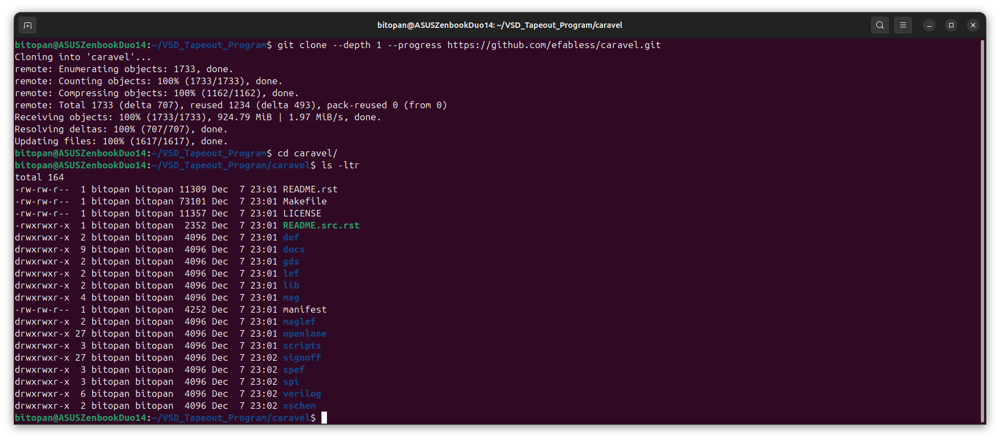
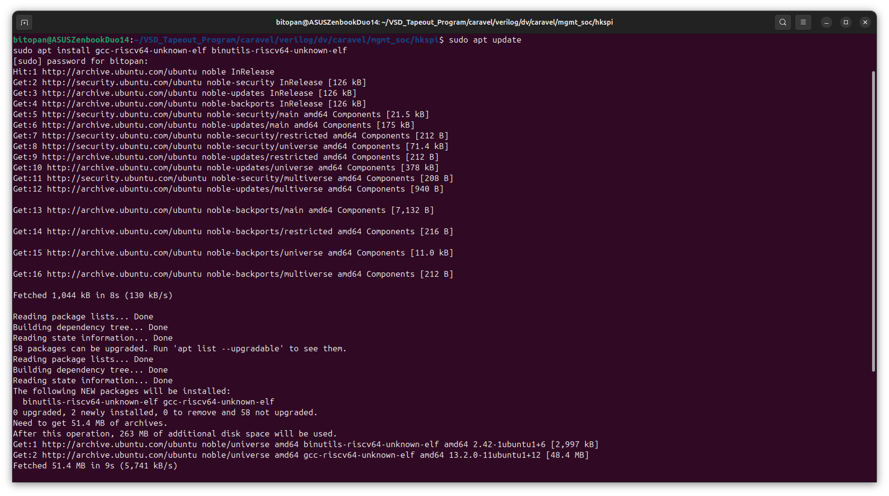

# Day 1 - Caravel Housekeeping SPI RTL-vs-GLS Verification

Summary of the day

---

## 📜 Table of Contents
[1. Objective](#-objectives)<br>
[2. Introduction to Caravel](#%EF%B8%8F-introduction-to-caravel)<br>
[3. Introduction to hkspi (Housekeeping SPI)](#-introduction-to-hkspi-housekeeping-spi)<br>

---

## 🎯 Objectives

The primary objective of Day 1 is to lay the groundwork for **functional equivalence verification** between Caravel’s RTL simulation and Gate-Level Simulation (GLS), starting with the `hkspi` design verification test.

Specifically, Day 1 focuses on:
- Setting up and validating the required **Caravel verification environment** using open-source tools and the Sky130 PDK
- Gaining a clear understanding of the **hkspi DV test**, its testbench, and its interaction with the Caravel management SoC
- Preparing for **RTL simulation execution** and subsequent GLS-based verification
- Establishing a structured workflow that can later be extended to **all DV tests** within the Caravel repository

---

## 🏗️ Introduction to Caravel

**Caravel** is an open-source **RISC-V–based System-on-Chip (SoC) integration platform** developed by efabless, designed to enable reproducible, fabrication-ready silicon using fully open-source toolchains and the Sky130 process.

  <div align="center">
    
  </div>

At a high level, Caravel consists of:
- A **management SoC** based on a RISC-V core, responsible for boot, configuration, and control
- A **user project area**, where custom designs can be integrated and fabricated
- A defined **interface boundary** between management and user logic, enabling standardized testing and verification
- On-chip peripherals and infrastructure such as GPIOs, SPI interfaces, clocking, and reset logic

Caravel serves as the reference platform for many open-source tapeout programs, providing a realistic SoC environment that mirrors industry-style chip integration while remaining accessible for academic and learning-focused use.

In this phase of the program, Caravel is treated not just as a black-box wrapper, but as a **verifiable SoC design**, where functional correctness must be proven across both **RTL simulation** and **Gate-Level Simulation (GLS)**. Ensuring identical behavior between these two representations is critical before moving toward signoff and tapeout.

The verification work in this phase focuses on Caravel’s **design verification (DV) tests**, beginning with the `hkspi` test, and gradually extending the same verification flow to all available DV tests within the Caravel repository.

For more information on Caravel, check [this](https://caravel-harness.readthedocs.io/en/latest/) out.

---

## 🔌 Introduction to hkspi (Housekeeping SPI)

The **hkspi (Housekeeping SPI)** is a critical internal interface within the Caravel SoC that enables **communication between the management SoC and on-chip housekeeping functions**. It acts as a control and status access path, allowing the management core to configure, monitor, and verify internal system behavior.

Functionally, hkspi is used to:
- Read and write internal **housekeeping registers**
- Access configuration and status information related to the management domain
- Validate correct integration and connectivity between control logic and peripherals

From a verification standpoint, hkspi is especially important because:
- It exercises **real management-to-peripheral communication paths**
- It involves protocol handling, register decoding, and data integrity
- It is sensitive to synthesis, timing, and gate-level effects

In this phase of the program, the `hkspi` design verification (DV) test serves as the **baseline test case** for establishing **functional equivalence between RTL simulation and Gate-Level Simulation (GLS)**. A successful match between RTL and GLS behavior for hkspi builds confidence in both the synthesis flow and the correctness of the generated gate-level netlist.

Once the verification flow is validated using hkspi, the same methodology can be systematically extended to **all other DV tests** in the Caravel verification suite.

---

## 🛠️ Environment Setup

A stable and verified development environment is essential before starting RTL and Gate-Level verification. Since this phase builds directly on the tooling used earlier, the focus here is on **validation and readiness**, rather than fresh installation.

### 1️⃣ Clone the Official Caravel Repository

The first step is to obtain the official Caravel source code maintained by efabless. This repository contains the RTL, verification tests, OpenLane configurations, and all supporting infrastructure required for simulation and synthesis.

Repository:
`https://github.com/efabless/caravel`

  <div align="center">
    
  </div>

This repository serves as the primary design and verification target for all subsequent RTL and GLS simulations in this phase.

### 2️⃣ Sky130 PDK Setup

The **Sky130 Process Design Kit (PDK)** is required for synthesis, gate-level simulation, and standard cell modeling.

- The Sky130 PDK was already installed and configured during **Phase 1** of the program.
- The existing installation is reused for Phase 2 to maintain toolchain consistency.
- Environment variables and paths associated with the Sky130 PDK are verified to ensure correct accessibility during GLS.

No reinstallation was required at this stage.

### 3️⃣ Verification of Required Tools

The following tools are required for simulation, firmware compilation, and waveform analysis:

- **iverilog** – for compiling RTL and gate-level simulations  
- **vvp** – for executing compiled simulation binaries  
- **GTKWave** – for viewing and analyzing waveform outputs  
- **riscv64-unknown-elf-gcc** – for compiling RISC-V firmware binaries used by Caravel DV tests  

The first 3 tools were already installed and used during the Phase 1. The gcc compiler has been installed here:

  <div align="center">
    
  </div>
    <div align="center">
    
  </div>

---

## 📂 Directory Structure Overview

The following directory tree provides a consolidated view of the **hkspi design verification environment** along with the **Sky130 standard cell** and **I/O cell libraries** used during RTL and Gate-Level Simulation.

```
/home/bitopan/VSD_Tapeout_Program/
├── caravel/
│   └── verilog/
│       └── dv/
│           └── caravel/
│               └── mgmt_soc/
│                   └── hkspi/
│                       ├── hkspi.c        # RISC-V firmware source
│                       ├── hkspi.hex      # Compiled firmware (hex)
│                       ├── hkspi_tb.v     # hkspi testbench
│                       └── Makefile       # Build and simulation control
│
└── open_pdks/
    └── sky130/
        └── sky130A/
            └── libs.ref/
                ├── sky130_fd_sc_hd/
                │   ├── gds
                │   ├── lef
                │   ├── mag
                │   └── verilog            # Standard cell Verilog models
                │
                └── sky130_fd_io/
                    ├── cdl
                    ├── gds
                    ├── lef
                    ├── lib
                    ├── mag
                    ├── spice
                    └── verilog            # I/O cell Verilog models
```
