# Task 2 - RISC-V SoC Research Task – Synopsys VCS + DC_TOPO Flow (SCL180)

Task 2 focused on transitioning the complete vsdcaravel RISC-V SoC flow from a guided setup to a fully research-driven, industry-grade Synopsys flow using VCS and DC_TOPO on the SCL180 PDK. The task involved replacing all open-source simulators, independently configuring RTL simulation, synthesis, and gate-level simulation, and restructuring the repository for long-term maintainability. Significant emphasis was placed on debugging toolchain- and library-related issues using Synopsys SolvNet, preserving POR and memory modules as blackboxes during synthesis, and validating RTL–GLS functional equivalence through housekeeping SPI tests. This task reinforced proficiency in professional EDA workflows, tool debugging discipline, and production-quality documentation practices.

---

## 📜 Table of Contents
[1. Objective](#-objective)<br>
[2. Environment](#%EF%B8%8F-environment)<br>
[3. Repository Structure](#-repository-structure)<br>
[4. Key Files](#%EF%B8%8F-key-files)<br>
[5. RTL Simulation (Synopsys VCS)](#%EF%B8%8F-rtl-simulation-synopsys-vcs)<br>
[6. RTL Simulation Errors and Debugging](#%EF%B8%8F-rtl-simulation-errors-and-debugging)<br>
[7. RTL Synthesis (Synopsys DC_TOPO)](#%EF%B8%8F-rtl-synthesis-synopsys-dc_topo)<br>
[8. Gate-Level Simulation (GLS) (Synopsys VCS)](#%EF%B8%8F-gate-level-simulation-gls)<br>
[9. GLS Errors and Debugging](#%EF%B8%8F-gls-errors-and-debugging)<br>
[10. References](#-references)<br>
[11. Acknowledgments](#-acknowledgments)<br>
[12. License](#-license)<br>
[13. Contact and Support](#-contact-and-support)

---

## 🎯 Objective

This task marks a deliberate shift from guided execution to independent, research-driven design practice, mirroring real-world semiconductor workflows. The objective is to transition the complete **vsdcaravel SoC verification and synthesis flow** from open-source tools to **industry-grade Synopsys tools**, while maintaining design correctness, reproducibility, and high documentation standards.

Specifically, the objectives of this task are to:

* Establish proficiency in **Synopsys VCS and DC_TOPO** by independently implementing RTL simulation, synthesis, and gate-level verification using **SCL180 PDKs**.
* Demonstrate the ability to **research, debug, and resolve tool-related issues autonomously**, leveraging official documentation and the Synopsys SolvNet knowledge base rather than step-by-step guidance.
* Execute a **clean and complete toolchain migration**, ensuring the total removal of all open-source simulators from scripts, Makefiles, logs, and documentation.
* Perform **functional simulation, synthesis, and gate-level simulation** with behaviorally consistent results, validating that post-synthesis GLS matches RTL intent without critical X-propagation.
* Preserve architectural intent by **retaining POR and memory blocks as RTL modules**, correctly integrating them into both synthesis and GLS flows.

Collectively, this task is designed to validate readiness for **production-level RTL development, synthesis closure, and verification workflows** in a professional semiconductor design environment.

---

## 🛠️ Environment

This section outlines the process technology and EDA toolchain adopted for implementing, synthesizing, and verifying the **vsdcaravel SoC** in an industry-aligned flow. The environment is intentionally chosen to mirror professional semiconductor design setups, with emphasis on robustness, reproducibility, and correctness.

### 1. PDKs: **SCL180**

The **SCL180** (Standard Cell Library, 180 nm) process technology is a mature and industry-proven CMOS node, widely used for mixed-signal and SoC designs where stability, reliability, and well-characterized libraries are critical. Its comprehensive support for standard cells and I/O pads makes it suitable for full-chip RTL-to-GDSII flows, including functional and gate-level verification.

For this task, the **Gate-Level Simulation (GLS)** flow relies on the following SCL180 library model paths:

* **Standard-cell VCS simulation models**

  ```
  .../scl180/stdcell/fs120/4M1IL/verilog/vcs_sim_model
  ```

* **CIO250 I/O pad Verilog models (zero-delay view)**

  ```
  .../scl180/iopad/cio250/4M1L/verilog/tsl18cio250/zero
  ```

These models are linked during GLS to accurately represent the synthesized logic and I/O behavior while preserving simulation efficiency.

### 2. Tools

#### A. Synopsys VCS

**Synopsys VCS** is a high-performance, industry-standard logic simulator used for both **RTL-level functional simulation** and **post-synthesis gate-level simulation**. In this flow, VCS is employed to:

* Validate functional correctness at the RTL stage
* Perform GLS using synthesized netlists and SCL180 functional cell models
* Generate simulation logs and waveform databases for detailed debugging

Its robustness, scalability, and deep debug capabilities make it a cornerstone of production-grade verification environments.

#### B. Synopsys Design Compiler (DC / DC_TOPO)

**Synopsys Design Compiler**, specifically the **DC_TOPO** flow, is used for logic synthesis of the vsdcaravel SoC. It translates RTL into a gate-level netlist mapped to **SCL180 standard cell libraries**, while honoring design constraints related to timing, area, and power.
In this task, DC_TOPO is used to:

* Synthesize the digital core of the SoC
* Generate timing, area, and power reports
* Preserve architectural intent by keeping POR and memory modules as RTL/blackboxes

This step bridges high-level design intent with manufacturable gate-level implementation.

#### C. GTKWave (Waveform Viewing)

Due to the current unavailability of **Synopsys Verdi**, **GTKWave** is used strictly as a waveform viewer to inspect simulation outputs generated by VCS (FSDB/VPD converted as required). Its usage is limited to visualization and debugging support, without impacting the core Synopsys-based simulation and synthesis flow.

Together, this environment establishes a disciplined, industry-relevant foundation for RTL development, synthesis, and verification using the SCL180 technology node.

---

## 📁 Repository Structure
The previous working directory has been restructured into a more cleaner structure for better workflow. From this task, the new directory structure will be utilised, as given below:

```
VsdRiscvScl180/
├── dv/                         # Design Verification
│   └── hkspi/                  # Housekeeping SPI testbench
│       ├── hkspi_tb.v          # RTL testbench
│       ├── hkspi.c             # Test firmware (C source)
│       ├── hkspi.hex           # Compiled firmware (Verilog hex format)
│       ├── hkspi.vvp           # Compiled simulation executable
│       ├── hkspi.vcd           # Waveform dump
│       ├── Makefile            # RTL simulation build script
│       └── APIs/               # Firmware support files
│
├── rtl/                        # RTL Source Files (The gl folder has been merged here, and all previous references of gl folder will now be referred to here)
│   ├── vsdcaravel.v            # Top-level SoC wrapper
│   ├── caravel.v               # Caravel core integration
│   ├── caravel_core.v          # Core logic implementation
│   ├── chip_io.v               # I/O interface
│   ├── VexRiscv_MinDebugCache.v # VexRiscv processor core
│   ├── housekeeping.v          # Housekeeping logic
│   ├── housekeeping_spi.v      # SPI interface
│   ├── mgmt_core_wrapper.v     # Management core wrapper
│   ├── digital_pll.v           # PLL with ring oscillator
│   ├── caravel_clocking.v      # Clock distribution
│   ├── RAM128.v, RAM256.v      # Memory blocks
│   ├── gpio_control_block.v    # GPIO control logic
│   ├── mprj_io.v               # Multi-project I/O
│   ├── pt3b02_wrapper.v        # I/O pad wrappers
│   ├── defines.v               # Design parameters
│   ├── primitives.v            # Basic primitives
│   └── scl180_wrapper/         # SCL180-specific wrappers
│       └── *.v                 # Technology-specific modules
│
├── synthesis/                  # Logic Synthesis
│   ├── synth.tcl               # Synopsys DC synthesis script
│   ├── vsdcaravel.sdc          # Timing constraints
│   ├── output/
│   │   └── vsdcaravel_synthesis.v  # Synthesized gate-level netlist
│   ├── report/
│   │   ├── qor_post_synth.rpt      # Quality of Results
│   │   ├── area_post_synth.rpt     # Area report
│   │   └── power_post_synth.rpt    # Power report
│   └── work_folder/            # DC working directory
│
└── gls/                        # Gate-Level Simulation
    ├── hkspi_tb.v              # GLS testbench
    ├── Makefile                # GLS build script
    ├── hkspi.hex               # Test firmware
    ├── hkspi.vvp               # Compiled GLS simulation
    └── hkspi.vcd               # GLS waveform
```

---

## 🗂️ Key Files

### 1. RTL Simulation
#### Key Input Files
* **Testbench**: `hkspi_tb.v` (`/home/bbaishya/vsdRiscvScl180/dv/hkspi/`)
* **RTL Design Files**: `*.v` (`/home/bbaishya/vsdRiscvScl180/rtl/`)
* **Global Definitions**: `defines.v` (`/home/bbaishya/vsdRiscvScl180/rtl/`)
* **Firmware Image**: `hkspi.hex` (`/home/bbaishya/vsdRiscvScl180/dv/hkspi/`)

#### Script
* **Makefile**: (`/home/bbaishya/vsdRiscvScl180/dv/hkspi/`)

#### Key Output Files
* `compile.log`: (`/home/bbaishya/vsdRiscvScl180/dv/hkspi/`)
* `simulation.log`: (`/home/bbaishya/vsdRiscvScl180/dv/hkspi/`)
* `simv`: (`/home/bbaishya/vsdRiscvScl180/dv/hkspi/`)

### 2. RTL Synthesis (DC / DC_TOPO)
#### Key Input Files
* **RTL Design Files**: `*.v` (`/home/bbaishya/vsdRiscvScl180/rtl/`)
* **Global Definitions**: `defines.v` (`/home/bbaishya/vsdRiscvScl180/rtl/`)
* **Blackbox Stub File**: `memory_por_blackbox_stubs.v` (`/home/bbaishya/vsdRiscvScl180/synthesis/`)
* **Technology Libraries (Liberty)**
  * CIO250 I/O library: `.../scl180/iopad/cio250/4M1L/liberty/tsl18cio250_min.db`
  * SCL180 standard cell library: `.../scl180/stdcell/fs120/4M1IL/liberty/lib_flow_ff/tsl18fs120_scl_ff.db`
* **Timing Constraints (Optional)**: `vsdcaravel.sdc` (`/home/bbaishya/vsdRiscvScl180/synthesis/`)

#### Script
* **Synthesis TCL Script**: `synth.tcl` (`/home/bbaishya/vsdRiscvScl180/synthesis/`) (user-invoked via `dc_shell`)

#### Key Output Files
* **Synthesized Netlist**: `vsdcaravel_synthesis.v` (`/home/bbaishya/vsdRiscvScl180/synthesis/output/`)
* **Design Database**: `vsdcaravel_synthesis.ddc` (`/home/bbaishya/vsdRiscvScl180/synthesis/output/`)
* **Generated Constraints**: `vsdcaravel_synthesis.sdc` (`/home/bbaishya/vsdRiscvScl180/synthesis/output/`)
* **Reports**: (`/home/bbaishya/vsdRiscvScl180/synthesis/report/`)
  * `area.rpt`
  * `power.rpt`
  * `timing.rpt`
  * `constraints.rpt`
  * `qor.rpt`
  * `blackbox_modules.rpt`

### 3. Gate-Level Simulation (GLS)
#### Key Input Files
* **Gate-Level Netlist**: `vsdcaravel_synthesis.v` (`/home/bbaishya/vsdRiscvScl180/synthesis/output/`)
* **Testbench**: `hkspi_tb.v` (`/home/bbaishya/vsdRiscvScl180/gls/`)
* **Firmware Image**: `hkspi.hex` (Copied from the RTL simulation directory and loaded during GLS.)
* **RTL Models for Blackboxes**: `/home/bbaishya/vsdRiscvScl180/rtl/`
  * `RAM128.v`, `RAM256.v`, `dummy_por.v`
* **Global Definitions**:
  * `defines.v` (`/home/bbaishya/vsdRiscvScl180/rtl/`)
* **SCL180 Simulation Models**
  * Standard-cell VCS models
    `.../scl180/stdcell/fs120/4M1IL/verilog/vcs_sim_model`
  * CIO250 I/O pad Verilog models (zero-delay)
    `.../scl180/iopad/cio250/4M1L/verilog/tsl18cio250/zero`

#### Script
* **GLS Makefile**:  `/home/bbaishya/vsdRiscvScl180/gls/`

#### Key Output Files
* `vcs_compile.log` (`/home/bbaishya/vsdRiscvScl180/gls/`)
* `simulation.log` (`/home/bbaishya/vsdRiscvScl180/gls/`)
* `simv` (`/home/bbaishya/vsdRiscvScl180/gls/`)
* `hkspi.vcd` (`/home/bbaishya/vsdRiscvScl180/gls/`)

---

## ⚙️ RTL Simulation (Synopsys VCS)

This section documents the **RTL-level functional simulation** of the `vsdcaravel` SoC using **Synopsys VCS**, validating correct Housekeeping SPI (HKSPI) functionality prior to synthesis.

### 1. Makefile
**Makefile**:

```makefile
# SPDX-FileCopyrightText: 2020 Efabless Corporation
#
# Licensed under the Apache License, Version 2.0 (the "License");
# you may not use this file except in compliance with the License.
# You may obtain a copy of the License at
#
#      http://www.apache.org/licenses/LICENSE-2.0
#
# Unless required by applicable law or agreed to in writing, software
# distributed under the License is distributed on an "AS IS" BASIS,
# WITHOUT WARRANTIES OR CONDITIONS OF ANY KIND, either express or implied.
# See the License for the specific language governing permissions and
# limitations under the License.
#
# SPDX-License-Identifier: Apache-2.0

# removing pdk path as everything has been included in one whole directory for this example.
# PDK_PATH = $(PDK_ROOT)/$(PDK)
scl_io_PATH = "/home/Synopsys/pdk/SCL_PDK_3/SCLPDK_V3.0_KIT/scl180/iopad/cio250/4M1L/verilog/tsl18cio250/zero"
VERILOG_PATH = ../../
RTL_PATH = $(VERILOG_PATH)/rtl
BEHAVIOURAL_MODELS = ../ 
RISCV_TYPE ?= rv32imc

FIRMWARE_PATH = ../
GCC_PATH?=/home/bbaishya/riscv-tools/bin
GCC_PREFIX?=riscv32-unknown-elf

SIM_DEFINES = +define+FUNCTIONAL +define+SIM

SIM?=RTL

.SUFFIXES:

PATTERN = hkspi

# Path to management SoC wrapper repository
scl_io_wrapper_PATH ?= $(RTL_PATH)/scl180_wrapper

# VCS compilation options
VCS_FLAGS = -sverilog +v2k -full64 -debug_all -lca -timescale=1ns/1ps
VCS_INCDIR = +incdir+$(BEHAVIOURAL_MODELS) \
             +incdir+$(RTL_PATH) \
             +incdir+$(scl_io_wrapper_PATH) \
             +incdir+$(scl_io_PATH)

# Output files
SIMV = simv
COMPILE_LOG = compile.log
SIM_LOG = simulation.log

.SUFFIXES:

all: compile

hex: ${PATTERN:=.hex}

# VCS Compilation target
compile: ${PATTERN}_tb.v ${PATTERN}.hex
	vcs $(VCS_FLAGS) $(SIM_DEFINES) $(VCS_INCDIR) \
	${PATTERN}_tb.v \
	-l $(COMPILE_LOG) \
	-o $(SIMV)

# Run simulation in batch mode
sim: compile
	./$(SIMV) -l $(SIM_LOG)

# Run simulation with GUI (DVE)
gui: compile
	./$(SIMV) -gui -l $(SIM_LOG) &

# Generate VPD waveform
vpd: compile
	./$(SIMV) -l $(SIM_LOG)
	@echo "VPD waveform generated. View with: dve -vpd vcdplus.vpd &"

# Generate FSDB waveform (if Verdi is available)
fsdb: compile
	./$(SIMV) -l $(SIM_LOG)
	@echo "FSDB waveform generated. View with: verdi -ssf <filename>.fsdb &"

#%.elf: %.c $(FIRMWARE_PATH)/sections.lds $(FIRMWARE_PATH)/start.s
#	${GCC_PATH}/${GCC_PREFIX}-gcc -march=$(RISCV_TYPE) -mabi=ilp32 -Wl,-Bstatic,-T,$(FIRMWARE_PATH)/sections.lds,--strip-debug -ffreestanding -nostdlib -o $@ $(FIRMWARE_PATH)/start.s $<

#%.hex: %.elf
#	${GCC_PATH}/${GCC_PREFIX}-objcopy -O verilog $< $@ 
	# to fix flash base address
#	sed -i 's/@10000000/@00000000/g' $@

#%.bin: %.elf
#	${GCC_PATH}/${GCC_PREFIX}-objcopy -O binary $< /dev/stdout | tail -c +1048577 > $@

check-env:
#ifndef PDK_ROOT
#	$(error PDK_ROOT is undefined, please export it before running make)
#endif
#ifeq (,$(wildcard $(PDK_ROOT)/$(PDK)))
#	$(error $(PDK_ROOT)/$(PDK) not found, please install pdk before running make)
#endif
ifeq (,$(wildcard $(GCC_PATH)/$(GCC_PREFIX)-gcc ))
	$(error $(GCC_PATH)/$(GCC_PREFIX)-gcc is not found, please export GCC_PATH and GCC_PREFIX before running make)
endif
# check for efabless style installation
ifeq (,$(wildcard $(PDK_ROOT)/$(PDK)/libs.ref/*/verilog))
#SIM_DEFINES := ${SIM_DEFINES} +define+EF_STYLE
endif

# ---- Clean ----

clean:
	rm -f $(SIMV) *.log *.vpd *.fsdb *.key
	rm -rf simv.daidir csrc DVEfiles verdiLog novas.* *.fsdb+
	rm -rf AN.DB

.PHONY: clean compile sim gui vpd fsdb all check-env
```

The Makefile is responsible for:
* Compiling the RTL and testbench using Synopsys VCS
* Linking required include directories and RTL sources
* Generating the simulation executable (`simv`)
* Running the simulation and producing logs

### 2. Commands to Run RTL Simulation

To run the RTL simulation, navigate to the HKSPI verification directory and invoke `make`:

```bash
cd /home/bbaishya/vsdRiscvScl180/dv/hkspi
make clean
make sim
```

### 3. RTL Simulation Result (Terminal Output)

  <div align="center">
    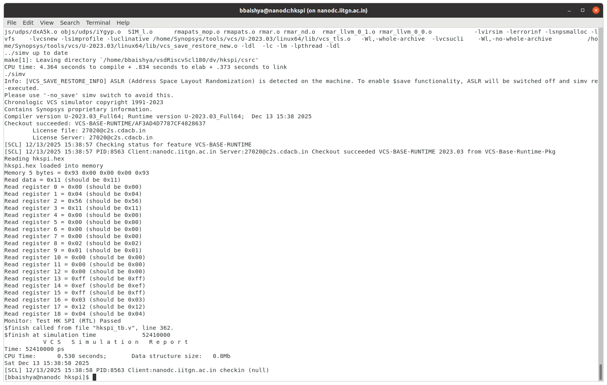
  </div>

### 4. Commands to View Waveforms (GTKWave)

To open the generated waveform:

```bash
gtkwave hkspi.vcd hkspi_tb.v
```

### 5. Waveform Observation

  <div align="center">
    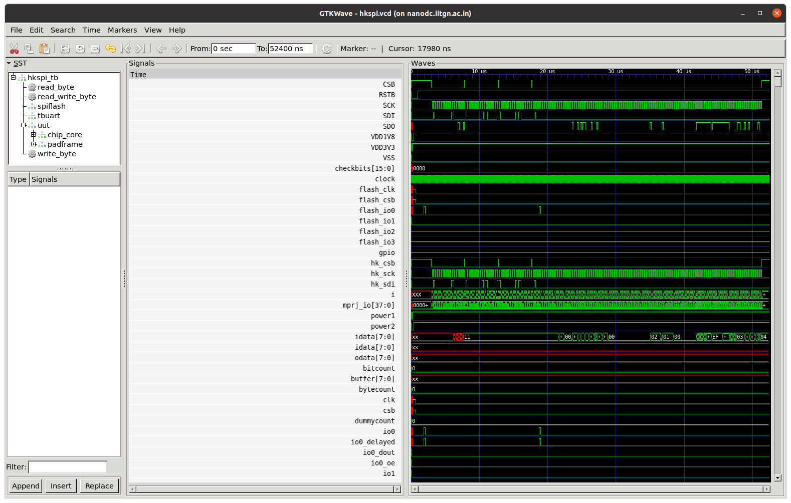
  </div>
  
### 6. Output Files

The following key output files are generated as part of the RTL simulation flow:

* `simv`
  *VCS-generated simulation executable*

* `compile.log`
  *Compilation log containing warnings and diagnostics*

* `simulation.log`
  *Runtime simulation log*

* `hkspi.vcd`
  *Waveform file used for signal-level analysis*

All output files are generated in:

```
/home/bbaishya/vsdRiscvScl180/synthesis/output
```

---

## 🛠️ RTL Simulation Errors and Debugging

### Issue 1: Undeclared Loop Variable in Testbench

  <div align="center">
    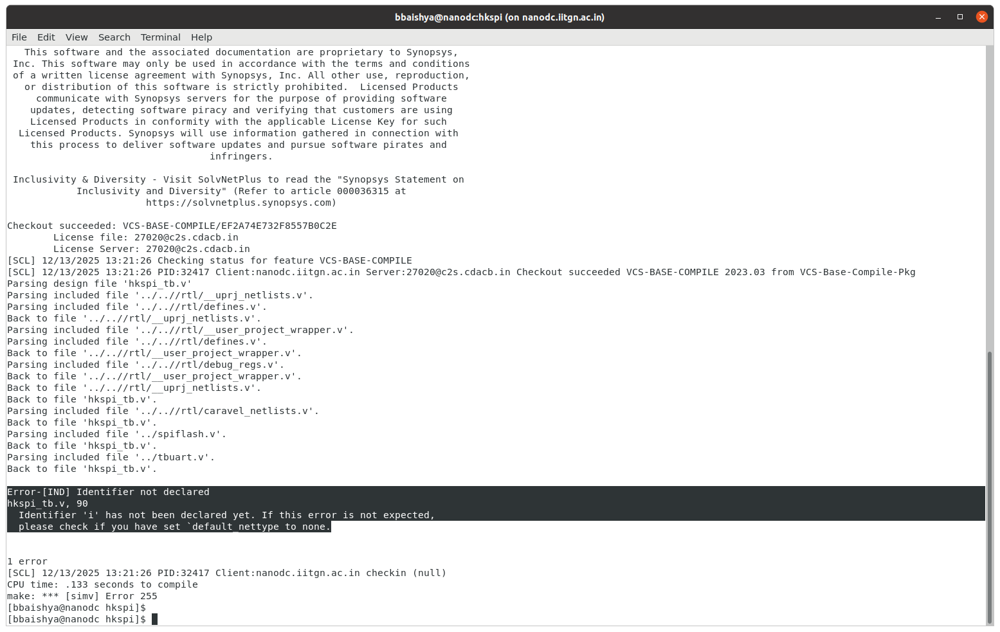
  </div>

#### Cause of the Error

The testbench (`hkspi_tb.v`) used a `for` loop variable `i` without explicitly declaring it. Since `default_nettype` was set to `none`, VCS did not implicitly create the variable, resulting in an undeclared identifier error.

#### How It Was Solved

The issue was resolved by explicitly declaring the loop variable as an integer in the testbench before its usage. This aligned the code with strict nettype rules and eliminated the compilation error.

### Issue 2: Missing POR Source File

  <div align="center">
    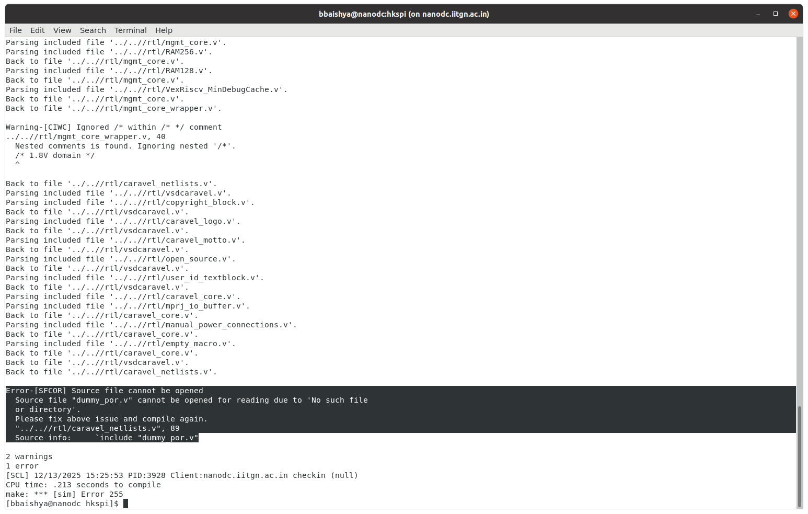
  </div>

#### Cause of the Error

The file `dummy_por.v` was referenced through a Verilog `include` directive inside `caravel_netlists.v`, but the file was not present in the expected search path during compilation. As a result, VCS failed to locate and open the source file.

#### How It Was Solved

The error was fixed by copying `dummy_por.v` into the HKSPI simulation directory and ensuring it was available in the compilation include path. This allowed the include directive to resolve correctly.

### Issue 3: Undeclared Signals in Schmitt Buffer Primitive

  <div align="center">
    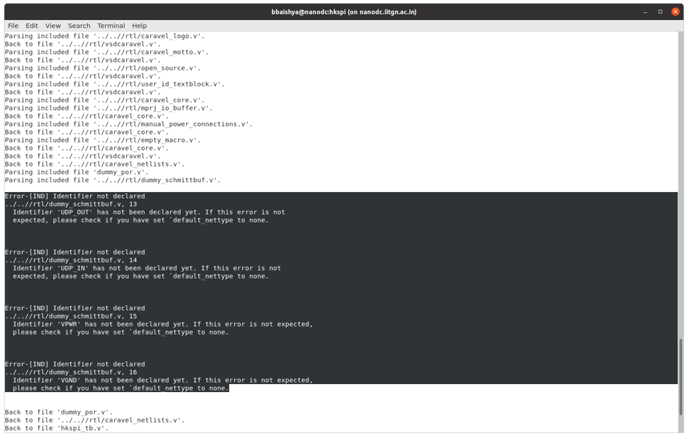
  </div>

#### Cause of the Error

In `dummy_schmittbuf.v`, the identifiers `UDP_OUT`, `UDP_IN`, `VPWR`, and `VGND` were used inside a UDP primitive before being explicitly declared. With `default_nettype none` enabled, VCS flagged these signals as undeclared.

#### How It Was Solved

The fix involved restructuring the file so that signal declarations were correctly associated with the UDP primitive definition. The `default_nettype none` directive was moved **after** the `primitive` block, ensuring that all ports were properly declared before strict nettype checking was enforced.

---

## ⚙️ RTL Synthesis (Synopsys DC_TOPO)

### 1. Synthesis TCL Script

```tcl
# ========================================================================
# Synopsys DC Synthesis Script for vsdcaravel
# Modified to keep POR and Memory modules as complete RTL blackboxes
# ========================================================================

# ========================================================================
# Load technology libraries
# ========================================================================
read_db "/home/Synopsys/pdk/SCL_PDK_3/SCLPDK_V3.0_KIT/scl180/iopad/cio250/4M1L/liberty/tsl18cio250_min.db"
read_db "/home/Synopsys/pdk/SCL_PDK_3/SCLPDK_V3.0_KIT/scl180/stdcell/fs120/4M1IL/liberty/lib_flow_ff/tsl18fs120_scl_ff.db"

# ========================================================================
# Set library variables
# ========================================================================
set target_library "/home/Synopsys/pdk/SCL_PDK_3/SCLPDK_V3.0_KIT/scl180/iopad/cio250/4M1L/liberty/tsl18cio250_min.db /home/Synopsys/pdk/SCL_PDK_3/SCLPDK_V3.0_KIT/scl180/stdcell/fs120/4M1IL/liberty/lib_flow_ff/tsl18fs120_scl_ff.db"
set link_library "* /home/Synopsys/pdk/SCL_PDK_3/SCLPDK_V3.0_KIT/scl180/iopad/cio250/4M1L/liberty/tsl18cio250_min.db /home/Synopsys/pdk/SCL_PDK_3/SCLPDK_V3.0_KIT/scl180/stdcell/fs120/4M1IL/liberty/lib_flow_ff/tsl18fs120_scl_ff.db"
set_app_var target_library $target_library
set_app_var link_library $link_library

# ========================================================================
# Define directory paths
# ========================================================================
set root_dir "/home/bbaishya/vsdRiscvScl180"
set io_lib "/home/Synopsys/pdk/SCL_PDK_3/SCLPDK_V3.0_KIT/scl180/iopad/cio250/4M1L/verilog/tsl18cio250/zero"
set verilog_files "$root_dir/rtl"
set top_module "vsdcaravel"
set output_file "$root_dir/synthesis/output/vsdcaravel_synthesis.v"
set report_dir "$root_dir/synthesis/report"

# ========================================================================
# Configure Blackbox Handling
# ========================================================================
# Prevent automatic memory inference and template saving
set_app_var hdlin_infer_multibit default_none
set_app_var hdlin_auto_save_templates false
set_app_var compile_ultra_ungroup_dw false

# ========================================================================
# Create Blackbox Stub File for Memory and POR Modules
# ========================================================================
set blackbox_file "$root_dir/synthesis/memory_por_blackbox_stubs.v"
set fp [open $blackbox_file w]
puts $fp "// Blackbox definitions for memory and POR modules"
puts $fp "// Auto-generated by synthesis script"
puts $fp ""

# RAM128 blackbox
puts $fp "(* blackbox *)"
puts $fp "module RAM128(CLK, EN0, VGND, VPWR, A0, Di0, Do0, WE0);"
puts $fp "  input CLK, EN0, VGND, VPWR;"
puts $fp "  input \[6:0\] A0;"
puts $fp "  input \[31:0\] Di0;"
puts $fp "  input \[3:0\] WE0;"
puts $fp "  output \[31:0\] Do0;"
puts $fp "endmodule"
puts $fp ""

# RAM256 blackbox
puts $fp "(* blackbox *)"
puts $fp "module RAM256(VPWR, VGND, CLK, WE0, EN0, A0, Di0, Do0);"
puts $fp "  input CLK, EN0;"
puts $fp "  inout VPWR, VGND;"
puts $fp "  input \[7:0\] A0;"
puts $fp "  input \[31:0\] Di0;"
puts $fp "  input \[3:0\] WE0;"
puts $fp "  output \[31:0\] Do0;"
puts $fp "endmodule"
puts $fp ""

# dummy_por blackbox
puts $fp "(* blackbox *)"
puts $fp "module dummy_por(vdd3v3, vdd1v8, vss3v3, vss1v8, porb_h, porb_l, por_l);"
puts $fp "  inout vdd3v3, vdd1v8, vss3v3, vss1v8;"
puts $fp "  output porb_h, porb_l, por_l;"
puts $fp "endmodule"
puts $fp ""

close $fp
puts "INFO: Created blackbox stub file: $blackbox_file"

# ========================================================================
# Read RTL Files
# ========================================================================
# Read defines first
read_file $verilog_files/defines.v

# ------------------------------------------------------------------------
# FIX 1: Define Macro for OpenFrame
# ------------------------------------------------------------------------
set_app_var hdlin_define_args "-DEFINE OPENFRAME_IOPADS"

# Read blackbox stubs FIRST (before actual RTL)
puts "INFO: Reading memory and POR blackbox stubs..."
read_file $blackbox_file -format verilog

# ========================================================================
# Read RTL files excluding memory and POR modules
# ========================================================================
puts "INFO: Building RTL file list (excluding RAM128.v, RAM256.v, and dummy_por.v)..."

# Get all verilog files
set all_rtl_files [glob -nocomplain ${verilog_files}/*.v]

# Define files to exclude
set exclude_files [list \
    "${verilog_files}/RAM128.v" \
    "${verilog_files}/RAM256.v" \
    "${verilog_files}/dummy_por.v" \
]

# Build list of files to read
set rtl_to_read [list]
foreach file $all_rtl_files {
    set excluded 0
    foreach excl_file $exclude_files {
        if {[string equal $file $excl_file]} {
            set excluded 1
            puts "INFO: Excluding $file (using blackbox instead)"
            break
        }
    }
    if {!$excluded} {
        lappend rtl_to_read $file
    }
}

puts "INFO: Reading [llength $rtl_to_read] RTL files..."

# Read all RTL files EXCEPT RAM128.v, RAM256.v, and dummy_por.v
read_file $rtl_to_read -define USE_POWER_PINS -format verilog

# ========================================================================
# Elaborate Design
# ========================================================================
puts "INFO: Elaborating design..."
define_design_lib WORK -path ./work_folder
elaborate $top_module

# ------------------------------------------------------------------------
# FIX 2: Verify Design Context
# ------------------------------------------------------------------------
if {[current_design] != $top_module} {
    puts "WARNING: Current design is [current_design], switching to $top_module..."
    current_design $top_module
}

# ========================================================================
# Set Blackbox Attributes for Memory Modules
# ========================================================================
puts "INFO: Setting Blackbox Attributes for Memory Modules..."

# Mark RAM128 as blackbox
if {[sizeof_collection [get_designs -quiet RAM128]] > 0} {
    set_attribute [get_designs RAM128] is_black_box true -quiet
    set_dont_touch [get_designs RAM128]
    puts "INFO: RAM128 marked as blackbox"
}

# Mark RAM256 as blackbox
if {[sizeof_collection [get_designs -quiet RAM256]] > 0} {
    set_attribute [get_designs RAM256] is_black_box true -quiet
    set_dont_touch [get_designs RAM256]
    puts "INFO: RAM256 marked as blackbox"
}

# ========================================================================
# Set POR (Power-On-Reset) Module as Blackbox
# ========================================================================
puts "INFO: Setting POR module as blackbox..."

# Mark dummy_por as blackbox
if {[sizeof_collection [get_designs -quiet dummy_por]] > 0} {
    set_attribute [get_designs dummy_por] is_black_box true -quiet
    set_dont_touch [get_designs dummy_por]
    puts "INFO: dummy_por marked as blackbox"
}

# Handle any other POR-related modules (case insensitive)
foreach_in_collection por_design [get_designs -quiet "*por*"] {
    set design_name [get_object_name $por_design]
    if {![string equal $design_name "dummy_por"]} {
        set_dont_touch $por_design
        set_attribute $por_design is_black_box true -quiet
        puts "INFO: $design_name set as blackbox"
    }
}

# ========================================================================
# Protect blackbox instances from optimization
# ========================================================================
puts "INFO: Protecting blackbox instances from optimization..."

# Protect all instances of RAM128, RAM256, and dummy_por
foreach blackbox_ref {"RAM128" "RAM256" "dummy_por"} {
    set instances [get_cells -quiet -hierarchical -filter "ref_name == $blackbox_ref"]
    if {[sizeof_collection $instances] > 0} {
        set_dont_touch $instances
        set inst_count [sizeof_collection $instances]
        puts "INFO: Protected $inst_count instance(s) of $blackbox_ref"
    }
}

# ========================================================================
# Link Design
# ========================================================================
puts "INFO: Linking design..."
link

# ========================================================================
# Uniquify Design
# ========================================================================
puts "INFO: Uniquifying design..."
uniquify

# ========================================================================
# Read SDC constraints (if exists)
# ========================================================================
if {[file exists "$root_dir/synthesis/vsdcaravel.sdc"]} {
    puts "INFO: Reading timing constraints..."
    read_sdc "$root_dir/synthesis/vsdcaravel.sdc"
}

# ========================================================================
# Compile Design (Topographical synthesis)
# ========================================================================
puts "INFO: Starting compilation..."
compile_ultra -incremental

# ========================================================================
# Write Outputs
# ========================================================================
puts "INFO: Writing output files..."

# Write Verilog netlist
write -format verilog -hierarchy -output $output_file
puts "INFO: Netlist written to: $output_file"

# Write DDC format for place-and-route
write -format ddc -hierarchy -output "$root_dir/synthesis/output/vsdcaravel_synthesis.ddc"
puts "INFO: DDC written to: $root_dir/synthesis/output/vsdcaravel_synthesis.ddc"

# Write SDC with actual timing constraints
write_sdc "$root_dir/synthesis/output/vsdcaravel_synthesis.sdc"
puts "INFO: SDC written to: $root_dir/synthesis/output/vsdcaravel_synthesis.sdc"

# ========================================================================
# Generate Reports
# ========================================================================
puts "INFO: Generating reports..."

report_area > "$report_dir/area.rpt"
report_power > "$report_dir/power.rpt"
report_timing -max_paths 10 > "$report_dir/timing.rpt"
report_constraint -all_violators > "$report_dir/constraints.rpt"
report_qor > "$report_dir/qor.rpt"

# Report on blackbox modules
puts "INFO: Generating blackbox module report..."
set bb_report [open "$report_dir/blackbox_modules.rpt" w]
puts $bb_report "========================================"
puts $bb_report "Blackbox Modules Report"
puts $bb_report "========================================"
puts $bb_report ""

foreach bb_module {"RAM128" "RAM256" "dummy_por"} {
    puts $bb_report "Module: $bb_module"
    set instances [get_cells -quiet -hierarchical -filter "ref_name == $bb_module"]
    if {[sizeof_collection $instances] > 0} {
        puts $bb_report "  Status: PRESENT"
        puts $bb_report "  Instances: [sizeof_collection $instances]"
        foreach_in_collection inst $instances {
            puts $bb_report "    - [get_object_name $inst]"
        }
    } else {
        puts $bb_report "  Status: NOT FOUND"
    }
    puts $bb_report ""
}
close $bb_report
puts "INFO: Blackbox report written to: $report_dir/blackbox_modules.rpt"

# ========================================================================
# Summary
# ========================================================================
puts ""
puts "INFO: ========================================"
puts "INFO: Synthesis Complete!"
puts "INFO: ========================================"
puts "INFO: Output netlist: $output_file"
puts "INFO: DDC file: $root_dir/synthesis/output/vsdcaravel_synthesis.ddc"
puts "INFO: SDC file: $root_dir/synthesis/output/vsdcaravel_synthesis.sdc"
puts "INFO: Reports directory: $report_dir"
puts "INFO: Blackbox stub file: $blackbox_file"
puts "INFO: "
puts "INFO: NOTE: The following modules are preserved as blackboxes:"
puts "INFO:   - RAM128 (Memory macro)"
puts "INFO:   - RAM256 (Memory macro)"
puts "INFO:   - dummy_por (Power-On-Reset circuit)"
puts "INFO: These modules will need to be replaced with actual macros during P&R"
puts "INFO: ========================================"

# Exit dc_shell
# dc_shell> exit
```

### 2. Command to Run Synthesis

Synthesis is executed using `dc_shell` with the TCL script as input.

```bash
dc_shell -f synth.tcl 
```

### 3. Synthesis Execution Result

  <div align="center">
    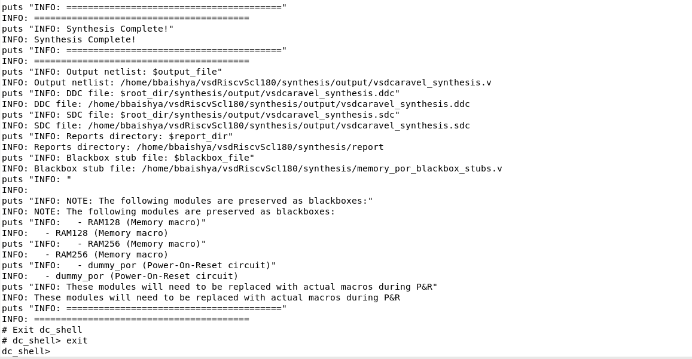
  </div>

### 4. Output Files

Upon successful synthesis, the following key output files are generated:
* [vsdcaravel_synthesis.v](https://github.com/BitopanBaishya/RISC-V-SoC-Tapeout-Program-2025---Phase-II/blob/main/Task_2/Post%20Synthesis%20Outputs/vsdcaravel_synthesis.v)
* [area_post_synth.rpt](https://github.com/BitopanBaishya/RISC-V-SoC-Tapeout-Program-2025---Phase-II/blob/main/Task_2/Post%20Synthesis%20Outputs/area_post_synth.rpt)
* [power_post_synth.rpt](https://github.com/BitopanBaishya/RISC-V-SoC-Tapeout-Program-2025---Phase-II/blob/main/Task_2/Post%20Synthesis%20Outputs/power_post_synth.rpt)
* [qor_post_synth.rpt](https://github.com/BitopanBaishya/RISC-V-SoC-Tapeout-Program-2025---Phase-II/blob/main/Task_2/Post%20Synthesis%20Outputs/qor_post_synth.rpt)

---

Locked in. Final lap energy. ⚡
Here’s a **clean, professional, GitHub-ready documentation section** for **Gate-Level Simulation (GLS)** using Synopsys VCS, structured exactly as requested.

---

## ⚙️ Gate-Level Simulation (GLS)

### 1. GLS Makefile

The GLS flow is driven using a dedicated **Makefile** located at:

```
/home/bbaishya/vsdRiscvScl180/gls
```

**Makefile:**
```makefile
# SPDX-FileCopyrightText: 2020 Efabless Corporation
#
# Licensed under the Apache License, Version 2.0 (the "License");
# you may not use this file except in compliance with the License.
# You may obtain a copy of the License at
#
# http://www.apache.org/licenses/LICENSE-2.0
#
# Unless required by applicable law or agreed to in writing, software
# distributed under the License is distributed on an "AS IS" BASIS,
# WITHOUT WARRANTIES OR CONDITIONS OF ANY KIND, either express or implied.
# See the License for the specific language governing permissions and
# limitations under the License.
#
# SPDX-License-Identifier: Apache-2.0

scl_io_PATH = "/home/Synopsys/pdk/SCL_PDK_3/SCLPDK_V3.0_KIT/scl180/iopad/cio250/4M1L/verilog/tsl18cio250/zero"
scl_io_wrapper_PATH = ../rtl/scl180_wrapper
VERILOG_PATH = ..
RTL_PATH = $(VERILOG_PATH)/rtl
# or you can copy all files to gl directory and then run with /gl instead
GL_PATH = $(VERILOG_PATH)/rtl
BEHAVIOURAL_MODELS = ../gls
RISCV_TYPE ?= rv32imc
PDK_PATH = /home/Synopsys/pdk/SCL_PDK_3/SCLPDK_V3.0_KIT/scl180/stdcell/fs120/4M1IL/verilog/vcs_sim_model 
FIRMWARE_PATH = ../gls
GCC_PATH?=/home/bbaishya/riscv32-unknown-elf/bin
GCC_PREFIX?=riscv32-unknown-elf

SIM_DEFINES = +define+FUNCTIONAL +define+SIM
SIM?=gl

.SUFFIXES:

PATTERN = hkspi

all: ${PATTERN:=.vcd}
hex: ${PATTERN:=.hex}
vcd: ${PATTERN:=.vcd}

hkspi.hex:
	cp /home/bbaishya/vsdRiscvScl180/dv/hkspi/hkspi.hex .

# VCS compilation target
simv: ${PATTERN}_tb.v ${PATTERN}.hex
	 vcs -full64 -debug_access+all \
	 $(SIM_DEFINES) +define+GL \
	 -timescale=1ns/1ps \
	 +v2k -sverilog \
	 -lca -kdb \
	 +incdir+$(VERILOG_PATH) \
	 +incdir+$(VERILOG_PATH)/synthesis/output \
	 +incdir+$(BEHAVIOURAL_MODELS) \
	 +incdir+$(RTL_PATH) \
	 +incdir+$(GL_PATH) \
	 +incdir+$(scl_io_wrapper_PATH) \
	 +incdir+$(scl_io_PATH) \
	 +incdir+$(PDK_PATH) \
	 -y $(scl_io_wrapper_PATH) +libext+.v+.sv \
	 -y $(RTL_PATH) +libext+.v+.sv \
	 -y $(GL_PATH) +libext+.v+.sv \
	 -y $(scl_io_PATH) +libext+.v+.sv \
	 -y $(PDK_PATH) +libext+.v+.sv \
	 $(GL_PATH)/defines.v \
	 $< \
	 -l vcs_compile.log \
	 -o simv

# Run simulation and generate VCD
%.vcd: simv
	 ./simv +vcs+dumpvars+${PATTERN}.vcd \
	 -l simulation.log

# Alternative: Generate FSDB waveform (if Verdi is available)
%.fsdb: simv
	 ./simv -ucli -do "dump -file ${PATTERN}.fsdb -type fsdb -add {*}" \
	 -l simulation.log

%.elf: %.c $(FIRMWARE_PATH)/sections.lds $(FIRMWARE_PATH)/start.s
	 ${GCC_PATH}/${GCC_PREFIX}-gcc -march=$(RISCV_TYPE) -mabi=ilp32 -Wl,-Bstatic,-T,$(FIRMWARE_PATH)/sections.lds,--strip-debug -ffreestanding -nostdlib -o $@ $(FIRMWARE_PATH)/start.s $<

%.hex: %.elf
	 ${GCC_PATH}/${GCC_PREFIX}-objcopy -O verilog $< $@ 
 # to fix flash base address
	 sed -i 's/@10000000/@00000000/g' $@

%.bin: %.elf
	 ${GCC_PATH}/${GCC_PREFIX}-objcopy -O binary $< /dev/stdout | tail -c +1048577 > $@

# Interactive debug with DVE
debug: simv
	 ./simv -gui -l simulation.log

# Coverage report generation (optional)
coverage: simv
	 ./simv -cm line+cond+fsm+tgl -cm_dir coverage.vdb
	 urg -dir coverage.vdb -report urgReport

check-env:
ifeq (,$(wildcard $(GCC_PATH)/$(GCC_PREFIX)-gcc ))
	 $(error $(GCC_PATH)/$(GCC_PREFIX)-gcc is not found, please export GCC_PATH and GCC_PREFIX before running make)
endif

clean:
	 rm -f *.elf *.hex *.bin *.vcd *.fsdb *.log simv
	 rm -rf csrc simv.daidir DVEfiles ucli.key *.vpd urgReport coverage.vdb AN.DB

.PHONY: clean hex vcd fsdb all debug coverage check-env# SPDX-FileCopyrightText: 2020 Efabless Corporation
```

### 2. Commands to Run GLS

To execute the Gate-Level Simulation, run the following commands:

```bash
cd /home/bbaishya/vsdRiscvScl180/gls
make clean
make
```

### 3. GLS Execution Result

  <div align="center">
    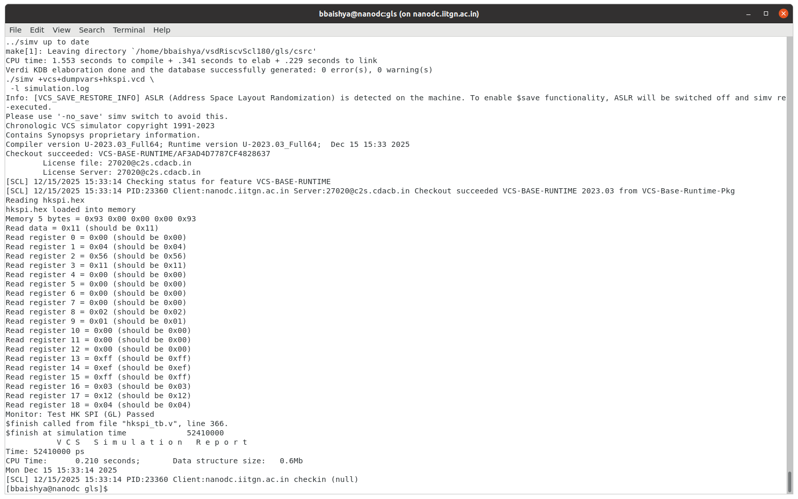
  </div>

### 4. Commands to View Waveforms

```bash
gtkwave hkspi.vcd hkspi_tb.v
```

This command opens the gate-level waveform along with the testbench, enabling correlation between stimulus and post-synthesis signal responses.

### 5. Waveform Observation

  <div align="center">
    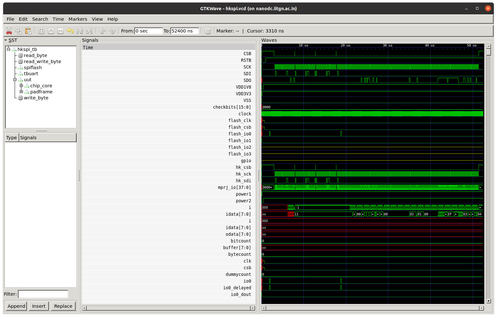
  </div>

### 6. Output Files

The following key output files are generated during GLS execution:

* `vcs_compile.log`
* `simulation.log`
* `hkspi.vcd`

All files are generated in:

```
/home/bbaishya/vsdRiscvScl180/gls
```

---

## 🛠️ GLS Errors and Debugging

### Error: Unresolved Module – `user_project_wrapper`

  <div align="center">
    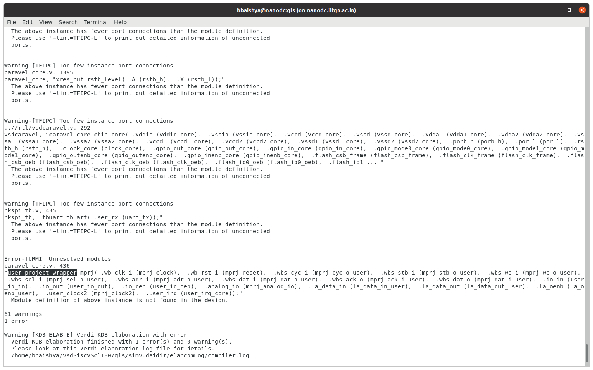
  </div>

#### Cause of the Error

During GLS compilation, Synopsys VCS reported an **unresolved module** error for the instance `user_project_wrapper` instantiated inside `caravel_core.v`. Although the instance was present, the corresponding module definition was not visible to the compiler.

This occurred because the RTL file containing the module definition was named `__user_project_wrapper.v`, which did not match the instantiated module name and was not being correctly picked up during compilation or inclusion.

#### How It Was Solved

The issue was resolved by:

* Renaming the RTL file from `__user_project_wrapper.v` to `user_project_wrapper.v` in the `rtl` directory

  <div align="center">
    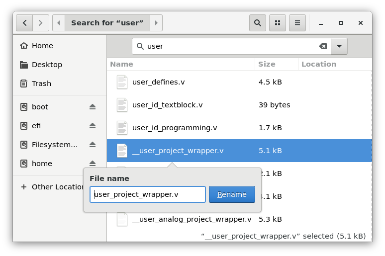
  </div>
  
* Explicitly adding the following include directive in `caravel_core.v` to ensure visibility during GLS compilation:

```verilog
`include "user_project_wrapper.v"
```

  <div align="center">
    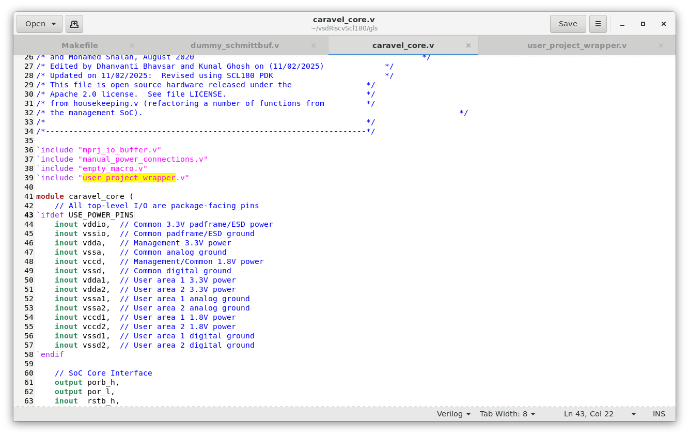
  </div>

After these changes, VCS successfully resolved the module definition, and the GLS compilation proceeded without unresolved module errors.

---

## 📚 References

### Official Documentation

1. **Synopsys Design Compiler User Guide** - T-2022.03-SP5
   - Synthesis methodology
   - Library setup and configuration
   - Constraint specification

2. **SCL 180nm PDK Documentation** - SCL_PDK_3 v3.0
   - Standard cell library characterization
   - I/O pad specifications
   - Design rules and guidelines

3. **Efabless Caravel Documentation**
   - Repository: https://github.com/efabless/caravel
   - Architecture overview
   - Integration guidelines

4. **VSD RISC-V Repository**
   - Repository: https://github.com/vsdip/vsdRiscvScl180/tree/iitgn
   - Reference implementation
   - Test procedures

### VexRiscv Core

- **Repository:** https://github.com/SpinalHDL/VexRiscv
- **License:** MIT License
- **Features:** RV32IMC instruction set, configurable pipeline

### Icarus Verilog and GTKWave

- **Icarus Verilog:** http://iverilog.icarus.com/
- **GTKWave:** http://gtkwave.sourceforge.net/

### Academic References

- **IIT Gandhinagar RISC-V SoC Tapeout Program**
  - 20-week program from RTL to silicon tapeout
  - Industry-grade tools and methodologies

---

## 🙏 Acknowledgments

This project is part of the **RISC-V Reference SoC Tapeout Program** conducted at **IIT Gandhinagar** in collaboration with **VLSI System Design (VSD)** and **Synopsys**.

### Team and Contributors

- **Institution:** Indian Institute of Technology Gandhinagar (IITGN)
- **Program:** RISC-V SoC Tapeout Program
- **PDK Support:** Synopsys SCL 180nm PDK v3.0
- **Base Design:** Efabless Caravel (Apache-2.0 License)
- **Processor Core:** VexRiscv (MIT License)
- **Date:** December 12, 2025

### Special Thanks

- IIT Gandhinagar faculty for infrastructure and guidance
- VSD for comprehensive training and support
- Synopsys for PDK access and tool licenses
- Open-source RISC-V community

---

## 📄 License

This project is licensed under the **Apache License 2.0**.

- **SPDX-License-Identifier:** Apache-2.0
- **Copyright:** 2025 IIT Gandhinagar

### Component Licenses

- **Caravel Framework:** Apache-2.0 (Efabless)
- **VexRiscv Core:** MIT License
- **SCL180 PDK:** Proprietary (Synopsys) - Educational Use

---

## 📬 Contact and Support

For questions, issues, or contributions:

- **Repository:** https://github.com/vsdip/vsdRiscvScl180
- **Branch:** iitgn
- **Institution:** IIT Gandhinagar
- **Program Website:** https://www.vlsisystemdesign.com/soc-labs/

---

**Last Updated:** December 19, 2025
