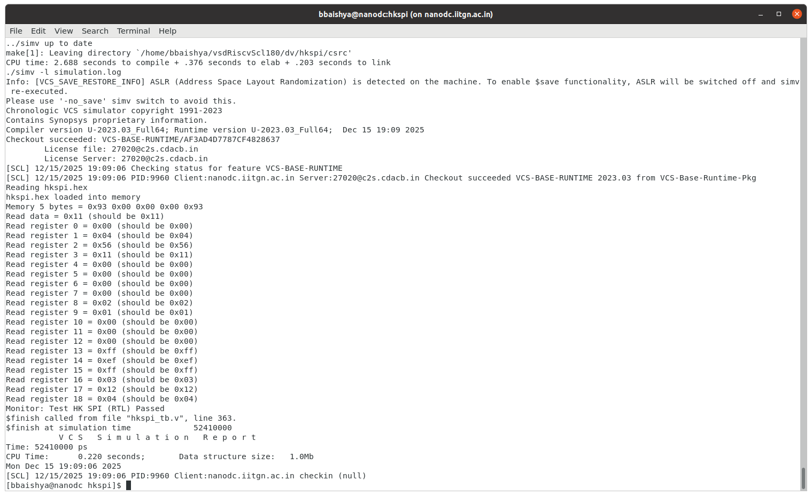
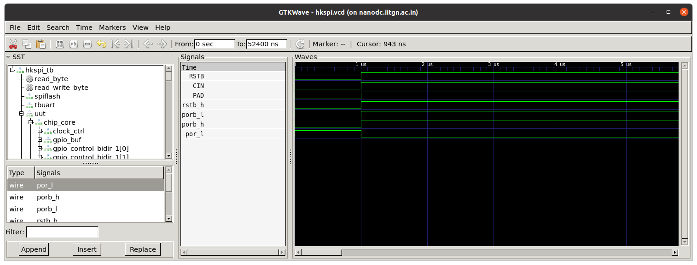
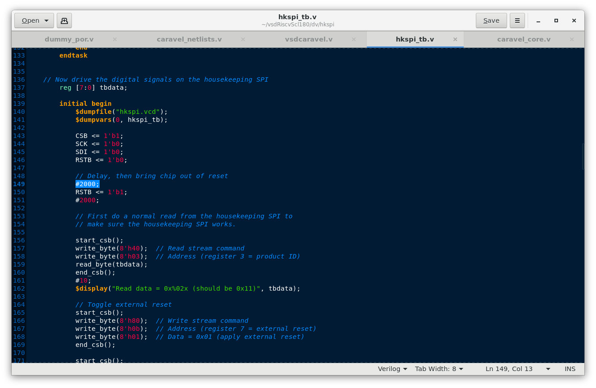
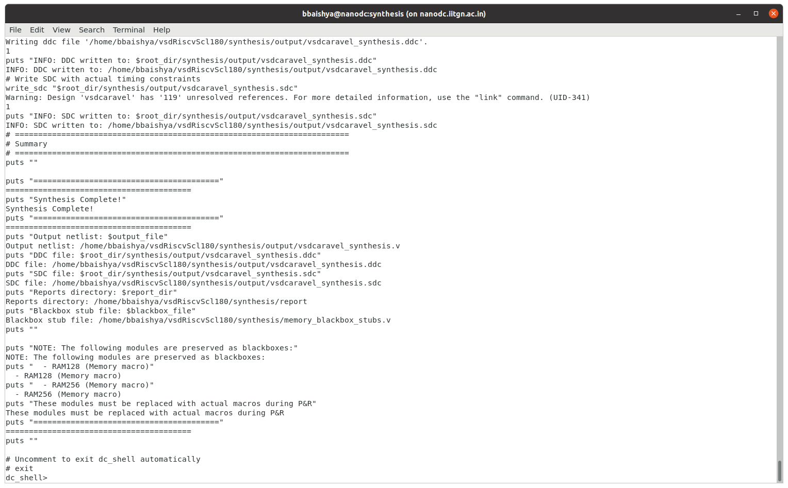
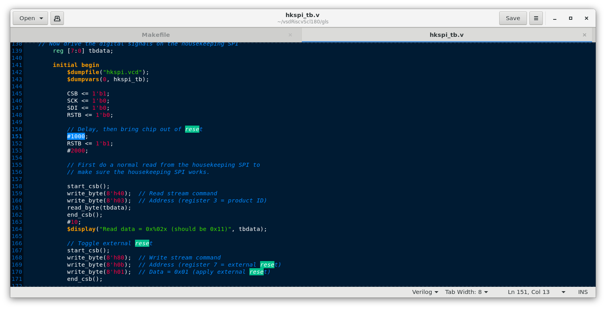
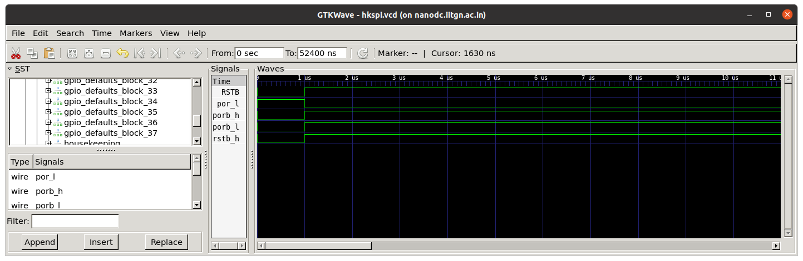
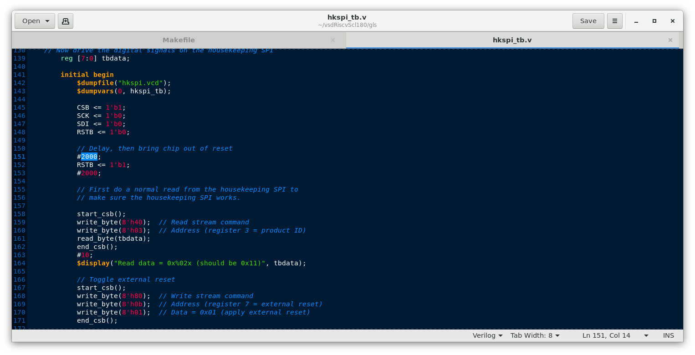
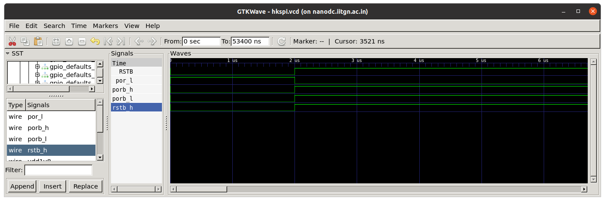

# Task 3 - Removal of On-Chip POR and Final GLS Validation (SCL-180)

Task 3 focused on removing the on-chip Power-On Reset (POR) from the VSD Caravel–based RISC-V SoC and validating an external reset-only architecture for the SCL-180 technology node. The task involved analyzing legacy POR dependencies from the SKY130-based design, justifying POR removal using SCL-180 pad behavior, and refactoring the RTL to eliminate all POR logic. A clean DC synthesis and final VCS-based gate-level simulation were performed, with RTL and GLS waveform analysis confirming that reset behavior is entirely testbench-driven and functionally correct.

---

## 📜 Table of Contents
[1. Objective](#-objective)<br>
[2. Justification for Removing On-Chip POR in SCL-180](#-justification-for-removing-on-chip-por-in-scl-180)<br>
[3. Design Strategy for POR Removal](#-design-strategy-for-por-removal)<br>
[4. RTL Simulation (Synopsys VCS)](#%EF%B8%8F-rtl-simulation-synopsys-vcs)<br>
[5. RTL Synthesis (Synopsys Design Compiler)](#%EF%B8%8F-rtl-synthesis-synopsys-design-compiler)<br>
[6. Gate-Level Simulation (GLS)](#%EF%B8%8F-gate-level-simulation-gls)<br>
[7. References](#-references)<br>
[8. Acknowledgments](#-acknowledgments)<br>
[9. License](#-license)<br>
[10. Contact and Support](#-contact-and-support)

---

## 🎯 Objective

This task focuses on a deliberate architectural cleanup step in the VSD Caravel–based RISC-V SoC by removing the on-chip digital Power-On Reset (POR) and validating an external reset-only strategy suitable for the SCL-180 technology node. The objective is to demonstrate—through pad analysis, RTL refactoring, synthesis, and final gate-level simulation—that a POR-free architecture is both safe and architecturally correct.

Specifically, the objectives of this task are to:
- Analyze and document existing POR dependencies and reset distribution paths within the SoC.
- Justify, using SCL-180 pad behavior and power-up assumptions, why an external reset pin is sufficient without an internal POR.
- Refactor the RTL to completely remove POR logic and migrate all sequential reset behavior to a single external active-low reset.
- Achieve a clean DC_TOPO synthesis with no POR blackboxes, unresolved resets, or unintended latch inference.
- Perform a final VCS-based gate-level simulation (GLS) using SCL-180 standard cells, demonstrating clean reset behavior and functional equivalence with RTL.
- Provide clear, industry-style documentation explaining why POR removal is correct, not just how it was implemented.

This task validates the ability to make and defend technology-aware architectural decisions and to carry them through synthesis and GLS with production-level rigor.

---

## 🧩 Justification for Removing On-Chip POR in SCL-180

The original Caravel architecture included an on-chip Power-On Reset (POR) to address **technology-specific power-up uncertainties** present in the SKY130 process. In SKY130, several digital standard cells and I/O pads do not guarantee deterministic behavior immediately after VDD ramp-up. As a result, an internal POR was required to hold the system in reset until power stabilized, ensuring safe release of sequential logic and preventing undefined states during early power-up.

In the original design, the POR effectively acted as a **digital surrogate for an analog problem**, compensating for incomplete or delayed availability of reset signals at the pad level. While functional for simulation and early silicon bring-up, this approach tightly coupled reset correctness to a behavioral construct that does not correspond to a synthesizable or portable hardware primitive.

The SCL-180 technology differs fundamentally in this regard. The SCL-180 I/O pad libraries provide **reset pads that are available immediately after VDD is applied**, with no documented requirement for internal POR-driven gating or enable sequencing. The reset pin is asynchronous, pad-driven, and designed to be externally asserted during power-up, allowing the SoC to remain safely held in reset until the system environment is stable.

Given these characteristics, retaining a digital POR inside the RTL is both **unnecessary and architecturally misleading**. Reset sequencing in SCL-180 is correctly handled at the **pad and board level**, not through internal digital logic attempting to infer power stability.

By removing the on-chip POR and adopting a single external reset pin, the design:

* Eliminates reliance on non-synthesizable, technology-specific reset behavior
* Aligns reset control with SCL-180 pad guarantees and power assumptions
* Improves architectural clarity by separating analog power concerns from digital logic
* Reduces reset-related complexity and potential failure modes in synthesis and GLS

Therefore, the removal of the on-chip POR is not only safe for SCL-180, but represents a **more correct, portable, and production-aligned reset strategy** for the current SoC implementation.

---

## 🧠 Design Strategy for POR Removal

The initial analysis revealed that the existing `dummy_por` module fans out multiple POR-related signals (`porb_h`, `porb_l`, `por_l`) to different subsystems across the SoC. Directly removing the module and replacing each of these signals with an external reset mapping would have been error-prone, intrusive, and difficult to validate incrementally.

As an intermediate step, the internal logic of `dummy_por` was removed and replaced with a single externally driven input port. The outgoing POR signals were looped back from this input and driven directly from the testbench. This approach preserved the existing signal connectivity, enabled controlled experimentation, and verified that the SoC functions correctly when reset behavior is externally driven.

However, upon further evaluation, this approach was deemed architecturally insufficient. Retaining a module named `dummy_por`, even as a pass-through, contradicts the objective of **complete POR removal** and risks implicitly preserving the concept of an internal reset generator within the design.

Consequently, the final and adopted strategy was to **entirely remove the `dummy_por` module and its sole instance from `caravel_core`**, eliminate all POR-related signals, and introduce a **single explicit external reset pin** at the top level of the SoC. This reset signal is now driven exclusively from the testbench and directly controls all sequential reset behavior.

This final approach ensures that:

* No residual POR semantics remain in the RTL
* Reset behavior is explicit, visible, and externally controlled
* The design accurately reflects a production-realistic, pad-driven reset architecture suitable for SCL-180

This strategy strictly aligns with the task objective of validating a **POR-free SoC architecture**, rather than masking POR behavior behind renamed or repurposed modules.

---

## ⚙️ RTL Simulation (Synopsys VCS)

### 1. Makefile
**Makefile**:

```makefile
# SPDX-FileCopyrightText: 2020 Efabless Corporation
#
# Licensed under the Apache License, Version 2.0 (the "License");
# you may not use this file except in compliance with the License.
# You may obtain a copy of the License at
#
#      http://www.apache.org/licenses/LICENSE-2.0
#
# Unless required by applicable law or agreed to in writing, software
# distributed under the License is distributed on an "AS IS" BASIS,
# WITHOUT WARRANTIES OR CONDITIONS OF ANY KIND, either express or implied.
# See the License for the specific language governing permissions and
# limitations under the License.
#
# SPDX-License-Identifier: Apache-2.0

scl_io_PATH = "/home/Synopsys/pdk/SCL_PDK_3/SCLPDK_V3.0_KIT/scl180/iopad/cio250/4MIL/verilog/tsl18cio250/zero"
VERILOG_PATH = ../..
RTL_PATH = $(VERILOG_PATH)/rtl
BEHAVIOURAL_MODELS = ../ 
RISCV_TYPE ?= rv32imc

FIRMWARE_PATH = ../
GCC_PATH?=/home/bbaishya/riscv-tools/bin
GCC_PREFIX?=riscv32-unknown-elf

SIM_DEFINES = +define+FUNCTIONAL +define+SIM

SIM?=RTL

.SUFFIXES:

PATTERN = hkspi

# Path to management SoC wrapper repository
scl_io_wrapper_PATH ?= $(RTL_PATH)/scl180_wrapper

# VCS compilation options
VCS_FLAGS = -sverilog +v2k -full64 -debug_all -lca -timescale=1ns/1ps
VCS_INCDIR = +incdir+$(BEHAVIOURAL_MODELS) \
             +incdir+$(RTL_PATH) \
             +incdir+$(scl_io_wrapper_PATH) \
             +incdir+$(scl_io_PATH)

# Output files
SIMV = simv
COMPILE_LOG = compile.log
SIM_LOG = simulation.log

.SUFFIXES:

all: compile

hex: ${PATTERN:=.hex}

# VCS Compilation target
compile: ${PATTERN}_tb.v ${PATTERN}.hex
	vcs $(VCS_FLAGS) $(SIM_DEFINES) $(VCS_INCDIR) \
	${PATTERN}_tb.v \
	-l $(COMPILE_LOG) \
	-o $(SIMV)

# Run simulation in batch mode
sim: compile
	./$(SIMV) -l $(SIM_LOG)

# Run simulation with GUI (DVE)
gui: compile
	./$(SIMV) -gui -l $(SIM_LOG) &

# Generate VPD waveform
vpd: compile
	./$(SIMV) -l $(SIM_LOG)
	@echo "VPD waveform generated. View with: dve -vpd vcdplus.vpd &"

# Generate FSDB waveform (if Verdi is available)
fsdb: compile
	./$(SIMV) -l $(SIM_LOG)
	@echo "FSDB waveform generated. View with: verdi -ssf <filename>.fsdb &"

#%.elf: %.c $(FIRMWARE_PATH)/sections.lds $(FIRMWARE_PATH)/start.s
#	${GCC_PATH}/${GCC_PREFIX}-gcc -march=$(RISCV_TYPE) -mabi=ilp32 -Wl,-Bstatic,-T,$(FIRMWARE_PATH)/sections.lds,--strip-debug -ffreestanding -nostdlib -o $@ $(FIRMWARE_PATH)/start.s $<

#%.hex: %.elf
#	${GCC_PATH}/${GCC_PREFIX}-objcopy -O verilog $< $@ 
	# to fix flash base address
#	sed -i 's/@10000000/@00000000/g' $@

#%.bin: %.elf
#	${GCC_PATH}/${GCC_PREFIX}-objcopy -O binary $< /dev/stdout | tail -c +1048577 > $@

check-env:
#ifndef PDK_ROOT
#	$(error PDK_ROOT is undefined, please export it before running make)
#endif
#ifeq (,$(wildcard $(PDK_ROOT)/$(PDK)))
#	$(error $(PDK_ROOT)/$(PDK) not found, please install pdk before running make)
#endif
ifeq (,$(wildcard $(GCC_PATH)/$(GCC_PREFIX)-gcc ))
	$(error $(GCC_PATH)/$(GCC_PREFIX)-gcc is not found, please export GCC_PATH and GCC_PREFIX before running make)
endif
# check for efabless style installation
ifeq (,$(wildcard $(PDK_ROOT)/$(PDK)/libs.ref/*/verilog))
#SIM_DEFINES := ${SIM_DEFINES} +define+EF_STYLE
endif

# ---- Clean ----

clean:
	rm -f $(SIMV) *.log *.vpd *.fsdb *.key
	rm -rf simv.daidir csrc DVEfiles verdiLog novas.* *.fsdb+
	rm -rf AN.DB

.PHONY: clean compile sim gui vpd fsdb all check-env
```

### 2. Commands to Run RTL Simulation

To run the RTL simulation, navigate to the HKSPI verification directory and invoke `make`:

```bash
cd /home/bbaishya/vsdRiscvScl180/dv/hkspi
make clean
make sim
```

### 3. RTL Simulation Result (Terminal Output)

  <div align="center">
    
  </div>

### 4. Commands to View Waveforms (GTKWave)

To open the generated waveform:

```bash
gtkwave hkspi.vcd hkspi_tb.v
```

### 5. Testbench-Driven Reset Validation via Waveform Comparison

To validate that POR-related signals were no longer internally generated and were instead fully controlled by the testbench, a targeted waveform comparison was performed before and after RTL synthesis.

In the initial setup, the Power-On Reset assertion duration in the testbench was modified from **1 μs to 2 μs**. This change was intentionally minimal to isolate reset behavior without affecting unrelated logic. Upon simulation, the internal reset-derived signals (`porb_h`, `porb_l`, and `por_l`) exhibited a corresponding shift in their assertion and de-assertion timings.

The immediate and proportional change observed in these internal signals directly reflected the updated testbench-driven POR timing, confirming that they were **no longer influenced by any internal reset generation logic**. Instead, their behavior was fully dictated by the externally applied reset stimulus.

This experiment provided clear evidence that reset control had been successfully externalized and that the internal POR signal paths were functionally transparent to the testbench, reinforcing the correctness of the reset refactoring prior to complete POR removal.

  <div align="center">
    
  </div>
  <div align="center">
    
  </div>
  <div align="center">
    
  </div>
  <div align="center">
    
  </div>
  
### 6. Output Files

The following key output files are generated as part of the RTL simulation flow:
* `simv`
  *VCS-generated simulation executable*
* `compile.log`
  *Compilation log containing warnings and diagnostics*
* `simulation.log`
  *Runtime simulation log*
* `hkspi.vcd`
  *Waveform file used for signal-level analysis*

All output files are generated in:

```
/home/bbaishya/vsdRiscvScl180/synthesis/output
```

---

## ⚙️ RTL Synthesis (Synopsys Design Compiler)

### 1. Synthesis TCL Script

```tcl
# ========================================================================
# Synopsys DC Synthesis Script for vsdcaravel
# Modified to blackbox RAM128 and RAM256 modules
# Based on golden TCL with minimal modifications
# ========================================================================

# ========================================================================
# Load Technology Libraries
# ========================================================================
read_db "/home/Synopsys/pdk/SCL_PDK_3/SCLPDK_V3.0_KIT/scl180/iopad/cio250/4M1L/liberty/tsl18cio250_min.db"
read_db "/home/Synopsys/pdk/SCL_PDK_3/SCLPDK_V3.0_KIT/scl180/stdcell/fs120/4M1IL/liberty/lib_flow_ff/tsl18fs120_scl_ff.db"

# ========================================================================
# Set Library Variables
# ========================================================================
set target_library "/home/Synopsys/pdk/SCL_PDK_3/SCLPDK_V3.0_KIT/scl180/iopad/cio250/4M1L/liberty/tsl18cio250_min.db /home/Synopsys/pdk/SCL_PDK_3/SCLPDK_V3.0_KIT/scl180/stdcell/fs120/4M1IL/liberty/lib_flow_ff/tsl18fs120_scl_ff.db"
set link_library "* /home/Synopsys/pdk/SCL_PDK_3/SCLPDK_V3.0_KIT/scl180/iopad/cio250/4M1L/liberty/tsl18cio250_min.db /home/Synopsys/pdk/SCL_PDK_3/SCLPDK_V3.0_KIT/scl180/stdcell/fs120/4M1IL/liberty/lib_flow_ff/tsl18fs120_scl_ff.db"
set_app_var target_library $target_library
set_app_var link_library $link_library

# ========================================================================
# Define Directory Paths
# ========================================================================
set root_dir "/home/bbaishya/vsdRiscvScl180"
set io_lib "/home/Synopsys/pdk/SCL_PDK_3/SCLPDK_V3.0_KIT/scl180/iopad/cio250/4M1L/verilog/tsl18cio250/zero"
set verilog_files "$root_dir/rtl"
set top_module "vsdcaravel"
set output_file "$root_dir/synthesis/output/vsdcaravel_synthesis.v"
set report_dir "$root_dir/synthesis/report"

# ========================================================================
# Configure Blackbox Handling for Memory Modules
# ========================================================================
puts "INFO: Configuring blackbox handling for RAM modules..."
set_app_var hdlin_infer_multibit default_none
set_app_var hdlin_auto_save_templates false

# ========================================================================
# Create Blackbox Stub File for RAM Modules
# ========================================================================
set blackbox_file "$root_dir/synthesis/memory_blackbox_stubs.v"
set fp [open $blackbox_file w]
puts $fp "// Blackbox definitions for memory modules"
puts $fp "// Auto-generated by synthesis script"
puts $fp ""
puts $fp "(* blackbox *)"
puts $fp "module RAM128(CLK, EN0, VGND, VPWR, A0, Di0, Do0, WE0);"
puts $fp "  input CLK, EN0, VGND, VPWR;"
puts $fp "  input \[6:0\] A0;"
puts $fp "  input \[31:0\] Di0;"
puts $fp "  input \[3:0\] WE0;"
puts $fp "  output \[31:0\] Do0;"
puts $fp "endmodule"
puts $fp ""
puts $fp "(* blackbox *)"
puts $fp "module RAM256(VPWR, VGND, CLK, WE0, EN0, A0, Di0, Do0);"
puts $fp "  input CLK, EN0;"
puts $fp "  inout VPWR, VGND;"
puts $fp "  input \[7:0\] A0;"
puts $fp "  input \[31:0\] Di0;"
puts $fp "  input \[3:0\] WE0;"
puts $fp "  output \[31:0\] Do0;"
puts $fp "endmodule"
puts $fp ""
close $fp
puts "INFO: Created blackbox stub file: $blackbox_file"

# ========================================================================
# Read Design Files
# ========================================================================
# Read defines first (as in golden script)
puts "INFO: Reading defines.v..."
read_file $verilog_files/defines.v

# Read blackbox stubs before any RTL
puts "INFO: Reading memory blackbox stubs..."
read_file $blackbox_file -format verilog

# Read IO library with autoread (as in golden script)
#puts "INFO: Reading IO library..."
#read_file $io_lib -autoread -define USE_POWER_PINS -format verilog

# Read scl180_wrapper with autoread (as in golden script)
#puts "INFO: Reading scl180_wrapper..."
#read_file $verilog_files/scl180_wrapper -autoread -define USE_POWER_PINS -format verilog

# ========================================================================
# Read Main RTL Files (Excluding RAM modules)
# ========================================================================
puts "INFO: Building RTL file list (excluding RAM128.v and RAM256.v)..."

# Get all verilog files from rtl directory
set all_rtl_files [glob -nocomplain ${verilog_files}/*.v]

# Define files to exclude
set exclude_files [list \
    "${verilog_files}/RAM128.v" \
    "${verilog_files}/RAM256.v" \
    "${verilog_files}/defines.v" \
]

# Build list of files to read (excluding RAM modules and defines which was already read)
set rtl_to_read [list]
foreach file $all_rtl_files {
    set excluded 0
    foreach excl_file $exclude_files {
        if {[string equal $file $excl_file]} {
            set excluded 1
            if {[string match "*RAM*.v" $file]} {
                puts "INFO: Excluding $file (using blackbox instead)"
            }
            break
        }
    }
    if {!$excluded} {
        lappend rtl_to_read $file
    }
}

puts "INFO: Reading [llength $rtl_to_read] RTL files..."
read_file $rtl_to_read -define USE_POWER_PINS -format verilog

# ========================================================================
# Read Timing Constraints
# ========================================================================
puts "INFO: Reading timing constraints..."
read_sdc "$root_dir/synthesis/vsdcaravel.sdc"
update_timing

# ========================================================================
# Elaborate Design
# ========================================================================
puts "INFO: Elaborating design..."
elaborate $top_module

# Verify current design context
if {[current_design] != $top_module} {
    puts "WARNING: Current design is [current_design], switching to $top_module..."
    current_design $top_module
}

# ========================================================================
# Set Blackbox Attributes for RAM Modules
# ========================================================================
puts "INFO: Setting blackbox attributes for RAM modules..."

# Mark RAM128 as blackbox
if {[sizeof_collection [get_designs -quiet RAM128]] > 0} {
    set_attribute [get_designs RAM128] is_black_box true -quiet
    set_dont_touch [get_designs RAM128]
    puts "INFO: RAM128 marked as blackbox and protected"
} else {
    puts "WARNING: RAM128 design not found"
}

# Mark RAM256 as blackbox
if {[sizeof_collection [get_designs -quiet RAM256]] > 0} {
    set_attribute [get_designs RAM256] is_black_box true -quiet
    set_dont_touch [get_designs RAM256]
    puts "INFO: RAM256 marked as blackbox and protected"
} else {
    puts "WARNING: RAM256 design not found"
}

# Protect all instances of RAM modules from optimization
puts "INFO: Protecting RAM module instances from optimization..."
foreach blackbox_ref {"RAM128" "RAM256"} {
    set instances [get_cells -quiet -hierarchical -filter "ref_name == $blackbox_ref"]
    if {[sizeof_collection $instances] > 0} {
        set_dont_touch $instances
        set inst_count [sizeof_collection $instances]
        puts "INFO: Protected $inst_count instance(s) of $blackbox_ref"
    } else {
        puts "INFO: No instances of $blackbox_ref found in design"
    }
}

# ========================================================================
# Link Design
# ========================================================================
puts "INFO: Linking design..."
link

# ========================================================================
# Uniquify and Flatten (Optional - Currently Commented Out)
# ========================================================================
# Note: These were commented out in the golden script
# Uncomment if needed for your design
#set_uniquify_design false
#set_flatten false

# ========================================================================
# Compile Design
# ========================================================================
puts "INFO: Starting compilation with compile_ultra -incremental..."
compile_ultra -incremental

# ========================================================================
# Generate Reports
# ========================================================================
puts "INFO: Generating synthesis reports..."

# Original reports from golden script
report_qor > "$report_dir/qor_post_synth.rpt"
report_area > "$report_dir/area_post_synth.rpt"
report_power > "$report_dir/power_post_synth.rpt"

# Additional reports
report_timing -max_paths 10 > "$report_dir/timing_post_synth.rpt"
report_constraint -all_violators > "$report_dir/constraints_post_synth.rpt"

# Blackbox modules report
puts "INFO: Generating blackbox module report..."
set bb_report [open "$report_dir/blackbox_modules.rpt" w]
puts $bb_report "========================================"
puts $bb_report "Blackbox Modules Report"
puts $bb_report "========================================"
puts $bb_report ""
puts $bb_report "Date: [date]"
puts $bb_report "Design: $top_module"
puts $bb_report ""

foreach bb_module {"RAM128" "RAM256"} {
    puts $bb_report "----------------------------------------"
    puts $bb_report "Module: $bb_module"
    puts $bb_report "----------------------------------------"
    
    # Check if design exists
    set design_exists [sizeof_collection [get_designs -quiet $bb_module]]
    if {$design_exists > 0} {
        puts $bb_report "  Design Status: PRESENT (blackbox)"
        
        # Check for instances
        set instances [get_cells -quiet -hierarchical -filter "ref_name == $bb_module"]
        set inst_count [sizeof_collection $instances]
        
        if {$inst_count > 0} {
            puts $bb_report "  Instance Count: $inst_count"
            puts $bb_report "  Instances:"
            foreach_in_collection inst $instances {
                puts $bb_report "    - [get_object_name $inst]"
            }
        } else {
            puts $bb_report "  Instance Count: 0 (not instantiated)"
        }
    } else {
        puts $bb_report "  Design Status: NOT FOUND"
        puts $bb_report "  Instance Count: N/A"
    }
    puts $bb_report ""
}

puts $bb_report "========================================"
puts $bb_report "End of Blackbox Report"
puts $bb_report "========================================"
close $bb_report
puts "INFO: Blackbox report written to: $report_dir/blackbox_modules.rpt"

# ========================================================================
# Write Output Files
# ========================================================================
puts "INFO: Writing output files..."

# Write Verilog netlist (as in golden script)
write -format verilog -hierarchy -output $output_file
puts "INFO: Netlist written to: $output_file"

# Write DDC format for place-and-route
write -format ddc -hierarchy -output "$root_dir/synthesis/output/vsdcaravel_synthesis.ddc"
puts "INFO: DDC written to: $root_dir/synthesis/output/vsdcaravel_synthesis.ddc"

# Write SDC with actual timing constraints
write_sdc "$root_dir/synthesis/output/vsdcaravel_synthesis.sdc"
puts "INFO: SDC written to: $root_dir/synthesis/output/vsdcaravel_synthesis.sdc"

# ========================================================================
# Summary
# ========================================================================
puts ""
puts "========================================"
puts "Synthesis Complete!"
puts "========================================"
puts "Output netlist: $output_file"
puts "DDC file: $root_dir/synthesis/output/vsdcaravel_synthesis.ddc"
puts "SDC file: $root_dir/synthesis/output/vsdcaravel_synthesis.sdc"
puts "Reports directory: $report_dir"
puts "Blackbox stub file: $blackbox_file"
puts ""
puts "NOTE: The following modules are preserved as blackboxes:"
puts "  - RAM128 (Memory macro)"
puts "  - RAM256 (Memory macro)"
puts "These modules must be replaced with actual macros during P&R"
puts "========================================"
puts ""

# Uncomment to exit dc_shell automatically
# exit
```

### 2. Command to Run Synthesis

Synthesis is executed using `dc_shell` with the TCL script as input.

```bash
dc_shell -f synth.tcl 
```

### 3. Synthesis Execution Result

  <div align="center">
    
  </div>

### 4. Output Files

Upon successful synthesis, the following key output files are generated:
* `vsdcaravel_synthesis.v`
* `vsdcaravel_synthesis.ddc`
* `vsdcaravel_synthesis.sdc`
* `area_post_synth.rpt`
* `power_post_synth.rpt`
* `qor_post_synth.rpt`
* `timing_post_synth.rpt`
* `blackbox_modules.rpt`
* `constraints_post_synth.rpt`
* `synthesis_complete.log`

---

## ⚙️ Gate-Level Simulation (GLS)

### 1. GLS Makefile

The GLS flow is driven using a dedicated **Makefile** located at:

```
/home/bbaishya/vsdRiscvScl180/gls
```

**Makefile:**
```makefile
# SPDX-FileCopyrightText: 2020 Efabless Corporation
#
# Licensed under the Apache License, Version 2.0 (the "License");
# you may not use this file except in compliance with the License.
# You may obtain a copy of the License at
#
# http://www.apache.org/licenses/LICENSE-2.0
#
# Unless required by applicable law or agreed to in writing, software
# distributed under the License is distributed on an "AS IS" BASIS,
# WITHOUT WARRANTIES OR CONDITIONS OF ANY KIND, either express or implied.
# See the License for the specific language governing permissions and
# limitations under the License.
#
# SPDX-License-Identifier: Apache-2.0

scl_io_PATH = "/home/Synopsys/pdk/SCL_PDK_3/SCLPDK_V3.0_KIT/scl180/iopad/cio250/4M1L/verilog/tsl18cio250/zero"
scl_io_wrapper_PATH = ../rtl/scl180_wrapper
VERILOG_PATH = ..
RTL_PATH = $(VERILOG_PATH)/rtl
# or you can copy all files to gl directory and then run with /gl instead
GL_PATH = $(VERILOG_PATH)/rtl
BEHAVIOURAL_MODELS = ../gls
RISCV_TYPE ?= rv32imc
PDK_PATH = /home/Synopsys/pdk/SCL_PDK_3/SCLPDK_V3.0_KIT/scl180/stdcell/fs120/4M1IL/verilog/vcs_sim_model 
FIRMWARE_PATH = ../gls
GCC_PATH?=/home/bbaishya/riscv-tools/bin
GCC_PREFIX?=riscv32-unknown-elf

SIM_DEFINES = +define+FUNCTIONAL +define+SIM
SIM?=gl

.SUFFIXES:

PATTERN = hkspi

all: ${PATTERN:=.vcd}
hex: ${PATTERN:=.hex}
vcd: ${PATTERN:=.vcd}

hkspi.hex:
	cp /home/bbaishya/vsdRiscvScl180/dv/hkspi/hkspi.hex .

# VCS compilation target
simv: ${PATTERN}_tb.v ${PATTERN}.hex
	 vcs -full64 -debug_access+all \
	 $(SIM_DEFINES) +define+GL \
	 -timescale=1ns/1ps \
	 +v2k -sverilog \
	 -lca -kdb \
	 +incdir+$(VERILOG_PATH) \
	 +incdir+$(VERILOG_PATH)/synthesis/output \
	 +incdir+$(BEHAVIOURAL_MODELS) \
	 +incdir+$(RTL_PATH) \
	 +incdir+$(GL_PATH) \
	 +incdir+$(scl_io_wrapper_PATH) \
	 +incdir+$(scl_io_PATH) \
	 +incdir+$(PDK_PATH) \
	 -y $(scl_io_wrapper_PATH) +libext+.v+.sv \
	 -y $(RTL_PATH) +libext+.v+.sv \
	 -y $(GL_PATH) +libext+.v+.sv \
	 -y $(scl_io_PATH) +libext+.v+.sv \
	 -y $(PDK_PATH) +libext+.v+.sv \
	 $(GL_PATH)/defines.v \
	 $< \
	 -l vcs_compile.log \
	 -o simv

# Run simulation and generate VCD
%.vcd: simv
	 ./simv +vcs+dumpvars+${PATTERN}.vcd \
	 -l simulation.log

# Alternative: Generate FSDB waveform (if Verdi is available)
%.fsdb: simv
	 ./simv -ucli -do "dump -file ${PATTERN}.fsdb -type fsdb -add {*}" \
	 -l simulation.log

%.elf: %.c $(FIRMWARE_PATH)/sections.lds $(FIRMWARE_PATH)/start.s
	 ${GCC_PATH}/${GCC_PREFIX}-gcc -march=$(RISCV_TYPE) -mabi=ilp32 -Wl,-Bstatic,-T,$(FIRMWARE_PATH)/sections.lds,--strip-debug -ffreestanding -nostdlib -o $@ $(FIRMWARE_PATH)/start.s $<

%.hex: %.elf
	 ${GCC_PATH}/${GCC_PREFIX}-objcopy -O verilog $< $@ 
 # to fix flash base address
	 sed -i 's/@10000000/@00000000/g' $@

%.bin: %.elf
	 ${GCC_PATH}/${GCC_PREFIX}-objcopy -O binary $< /dev/stdout | tail -c +1048577 > $@

# Interactive debug with DVE
debug: simv
	 ./simv -gui -l simulation.log

# Coverage report generation (optional)
coverage: simv
	 ./simv -cm line+cond+fsm+tgl -cm_dir coverage.vdb
	 urg -dir coverage.vdb -report urgReport

check-env:
ifeq (,$(wildcard $(GCC_PATH)/$(GCC_PREFIX)-gcc ))
	 $(error $(GCC_PATH)/$(GCC_PREFIX)-gcc is not found, please export GCC_PATH and GCC_PREFIX before running make)
endif

clean:
	 rm -f *.elf *.hex *.bin *.vcd *.fsdb *.log simv
	 rm -rf csrc simv.daidir DVEfiles ucli.key *.vpd urgReport coverage.vdb AN.DB

.PHONY: clean hex vcd fsdb all debug coverage check-env# SPDX-FileCopyrightText: 2020 Efabless Corporation
```

### 2. Commands to Run GLS

To execute the Gate-Level Simulation, run the following commands:

```bash
cd /home/bbaishya/vsdRiscvScl180/gls
make clean
make
```

### 3. GLS Execution Result

  <div align="center">
    
  </div>

### 4. Commands to View Waveforms

```bash
gtkwave hkspi.vcd hkspi_tb.v
```

### 4. Post-GLS Reset Control Validation

Following successful RTL synthesis, a similar waveform-based validation was performed during gate-level simulation (GLS) using the synthesized netlist and SCL-180 functional standard cell models.

As in the RTL validation phase, the reset assertion duration in the testbench was intentionally modified from 1 μs to 2 μs. The resulting GLS waveforms showed a precise and corresponding shift in the assertion and de-assertion timings of the reset-derived internal signals. This behavior remained consistent despite the presence of synthesized reset trees and standard cell primitives.

Crucially, the internal signals previously associated with POR behavior exhibited no independent or delayed transitions, and no X-propagation was observed during reset release. All reset activity was cleanly synchronized to the externally driven reset stimulus provided by the testbench.

This result confirms that, even after synthesis and technology mapping, reset authority resides entirely outside the SoC, with no hidden POR logic reintroduced by the toolchain. The consistency between RTL and GLS waveforms provides final proof that the POR-free reset architecture is functionally correct and stable in an SCL-180 implementation.

  <div align="center">
    
  </div>
  <div align="center">
    
  </div>
  <div align="center">
    
  </div>
  <div align="center">
    
  </div>

### 6. Output Files

The following key output files are generated during GLS execution:

* `vcs_compile.log`
* `simulation.log`
* `hkspi.vcd`

All files are generated in:

```
/home/bbaishya/vsdRiscvScl180/gls
```

---

## 📚 References

### Official Documentation

1. **Synopsys Design Compiler User Guide** - T-2022.03-SP5
   - Synthesis methodology
   - Library setup and configuration
   - Constraint specification

2. **SCL 180nm PDK Documentation** - SCL_PDK_3 v3.0
   - Standard cell library characterization
   - I/O pad specifications
   - Design rules and guidelines

3. **Efabless Caravel Documentation**
   - Repository: https://github.com/efabless/caravel
   - Architecture overview
   - Integration guidelines

4. **VSD RISC-V Repository**
   - Repository: https://github.com/vsdip/vsdRiscvScl180/tree/iitgn
   - Reference implementation
   - Test procedures

### VexRiscv Core

- **Repository:** https://github.com/SpinalHDL/VexRiscv
- **License:** MIT License
- **Features:** RV32IMC instruction set, configurable pipeline

### Icarus Verilog and GTKWave

- **Icarus Verilog:** http://iverilog.icarus.com/
- **GTKWave:** http://gtkwave.sourceforge.net/

### Academic References

- **IIT Gandhinagar RISC-V SoC Tapeout Program**
  - 20-week program from RTL to silicon tapeout
  - Industry-grade tools and methodologies

---

## 🙏 Acknowledgments

This project is part of the **RISC-V Reference SoC Tapeout Program** conducted at **IIT Gandhinagar** in collaboration with **VLSI System Design (VSD)** and **Synopsys**.

### Team and Contributors

- **Institution:** Indian Institute of Technology Gandhinagar (IITGN)
- **Program:** RISC-V SoC Tapeout Program
- **PDK Support:** Synopsys SCL 180nm PDK v3.0
- **Base Design:** Efabless Caravel (Apache-2.0 License)
- **Processor Core:** VexRiscv (MIT License)
- **Date:** December 12, 2025

### Special Thanks

- IIT Gandhinagar faculty for infrastructure and guidance
- VSD for comprehensive training and support
- Synopsys for PDK access and tool licenses
- Open-source RISC-V community

---

## 📄 License

This project is licensed under the **Apache License 2.0**.

- **SPDX-License-Identifier:** Apache-2.0
- **Copyright:** 2025 IIT Gandhinagar

### Component Licenses

- **Caravel Framework:** Apache-2.0 (Efabless)
- **VexRiscv Core:** MIT License
- **SCL180 PDK:** Proprietary (Synopsys) - Educational Use

---

## 📬 Contact and Support

For questions, issues, or contributions:

- **Repository:** https://github.com/vsdip/vsdRiscvScl180
- **Branch:** iitgn
- **Institution:** IIT Gandhinagar
- **Program Website:** https://www.vlsisystemdesign.com/soc-labs/

---

**Last Updated:** December 22, 2025
